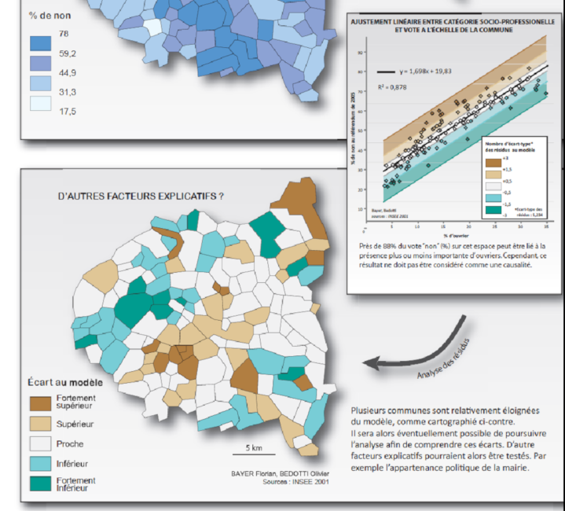

```{r setup, global_options,include=FALSE}
knitr::opts_chunk$set(
  dpi = 200,
  #fig.width = 7,
  #fig.height = 4,
  strip.white = T,
  #dev = "png",
  #dev.args = list(png = list(bg = "transparent")),
  message=FALSE,
  comment=NA,
  echo=FALSE,
  warning=FALSE,
  eval=TRUE
  
)
```

```{r include=FALSE}
source('../assets/functions.R')

# Les librairies
requiredPackages = c('knitr','png','grid','gridExtra',
                     'RColorBrewer','dotenv')

PackageFacile(requiredPackages)

Plotly = TRUE
load_dot_env("../.env")
annee=Sys.getenv("annee")


```


class: center, middle, inverse, title-slide, animated, fadeIn
# Cartographie et statistique M1 $annee$
# Présentation du cours <br /> 
### Fiche à remplir : https://tinyurl.com/cartoP1
<br />
### Florian Bayer


<div class="my-footer"><span>Université Paris 1 Panthéon Sorbonne - M1 $annee$ : cartographie et statistique - Florian Bayer</span></div> 

---
class: animated, fadeIn
## Déroulement des séances
   
- 10 séances de 2 heures  
- 45 minutes à 1 heure de cours par séance puis travaux dirigés 
- Des fiches avec les notions essentielles à connaître 
- Cours, exercices et bibliographie sur l’EPI Paris 1
- florian.bayer@gmail.com

<div class="my-footer"><span>Université Paris 1 Panthéon Sorbonne - M1 $annee$ : cartographie et statistique - Florian Bayer</span></div> 

---
class: animated, fadeIn
## Contenu de l’enseignement
<div class="my-footer"><span>Université Paris 1 Panthéon Sorbonne - M1 $annee$ : cartographie et statistique - Florian Bayer</span></div> 


.pull-left3[
- Identifier le message à **transmettre** avec la carte  
- Traiter l’information statistique de manière simple, pour **l’adapter au message cartographique**  
- Choisir les méthodes de **représentations cartographiques** adaptées  
- Créer un fond de carte (Illustrator et/ou Phildigit)  
- Utilisation d’un outil de cartographique automatique (Philcarto)  
- Utilisation d’Inkscape // Adobe Illustrator --> mise en page de la carte.  
- Représenter des résultats d’analyses statistiques plus ou moins complexes en cartographie (selon le niveau de chacun)  
- Utiliser des outils statistiques bi ou multivariés et les représenter sur une carte (selon le niveau de chacun)  
]

--

.center-img[ .pull-right1[

```{r echo=FALSE, out.width="100%"}
knitr::include_graphics("./images/margaret-hamilton.jpg")
```
.legend[Notes de cours d'une étudiante à la fin du semestre]
]]


---
class: animated, fadeIn
## Evaluation

.pull-left[
**Une étude cartographique avec choix du sujet libre**
> -Une quinzaine de pages  
> -5 à 6 cartes  
> -Commentaires géographiques  
> -Commentaires justifiant l’ensemble des choix  
> -En binôme  
]

.pull-right[

**Optionnel**
> -un exercice de discrétisation  
]

<div class="my-footer"><span>Université Paris 1 Panthéon Sorbonne - M1 $annee$ : cartographie et statistique - Florian Bayer</span></div> 

---
class: animated, fadeIn
## Calendrier prévisionnel

.zoom[
```{r echo=FALSE, out.width="100%"}

```
]

<div class="my-footer"><span>Université Paris 1 Panthéon Sorbonne - M1 $annee$ : cartographie et statistique - Florian Bayer</span></div> 

---
class: inverse, center, middle, animated, fadeIn
# Exemples de travaux


<div class="my-footer-title "></div> 

---
class: animated, fadeIn
## Exemples de travaux -1

<div style="display:table-cell; vertical-align:middle; horizontal-align:center">

.zoom[ .pull-left[
```{r echo=FALSE, out.width="100%"}

```
]

.pull-right[
```{r echo=FALSE, out.width="100%"}

```
] ]
</div>

<div class="my-footer"><span>Université Paris 1 Panthéon Sorbonne - M1 $annee$ : cartographie et statistique - Florian Bayer</span></div> 

---
class: animated, fadeIn
## Exemples de travaux -2
<div style="display:table-cell; vertical-align:middle; horizontal-align:center">

.zoom[ .pull-left[
```{r echo=FALSE, out.width="100%"}
knitr::include_graphics("./images/Image3.png")
```
]

.pull-right[
```{r echo=FALSE, out.width="100%"}

```
] ]
</div>

<div class="my-footer"><span>Université Paris 1 Panthéon Sorbonne - M1 $annee$ : cartographie et statistique - Florian Bayer</span></div> 

---
class: animated, fadeIn
## Exemples de travaux -3

.zoom[ .pull-left[ <div style="display:table-cell; vertical-align:middle; horizontal-align:center">
```{r echo=FALSE, out.width="100%"}

```
</div> ]

.pull-right[ <div style="display:table-cell; vertical-align:middle; horizontal-align:center">
```{r echo=FALSE, out.width="100%"}

```
] ]
</div>

<div class="my-footer"><span>Université Paris 1 Panthéon Sorbonne - M1 $annee$ : cartographie et statistique - Florian Bayer</span></div> 

---
class: animated, fadeIn
## Exemples de travaux -4
<div style="display:table-cell; vertical-align:middle; horizontal-align:center">
.zoom[ .pull-left[
```{r echo=FALSE, out.width="100%"}
knitr::include_graphics("./images/Image7.png")
```
]

.pull-right[
```{r echo=FALSE, out.width="100%"}

```
] ]
</div> 

<div class="my-footer"><span>Université Paris 1 Panthéon Sorbonne - M1 $annee$ : cartographie et statistique - Florian Bayer</span></div> 

---
class: animated, fadeIn 
## Exemples de travaux -5

.zoom[ .center-img[
```{r echo=FALSE, out.width="60%"}

```
] ]

<div class="my-footer"><span>Université Paris 1 Panthéon Sorbonne - M1 $annee$ : cartographie et statistique - Florian Bayer</span></div> 

---
class: animated, fadeIn
## Exemples de travaux -6
<div style="display:table-cell; vertical-align:middle; horizontal-align:center">

.zoom[ .pull-left[ 
```{r echo=FALSE, out.width="100%"}

```
]

.pull-right[
```{r echo=FALSE, out.width="100%"}

```
] ]
</div>

<div class="my-footer"><span>Université Paris 1 Panthéon Sorbonne - M1 $annee$ : cartographie et statistique - Florian Bayer</span></div> 

---
class: animated, fadeIn
## Exemples de travaux -7
.zoom[ .center-img[
```{r echo=FALSE, out.width="60%"}
knitr::include_graphics("./images/Image13.png")
```
] ]

<div class="my-footer"><span>Université Paris 1 Panthéon Sorbonne - M1 $annee$ : cartographie et statistique - Florian Bayer</span></div> 

---
class: animated, fadeIn
## Exemples de travaux -8
<div style="display:table-cell; vertical-align:middle; horizontal-align:center">

.zoom[ 
```{r echo=FALSE, out.width="100%"}
knitr::include_graphics("./images/stat1.png")
```
]

</div>

<div class="my-footer"><span>Université Paris 1 Panthéon Sorbonne - M1 $annee$ : cartographie et statistique - Florian Bayer</span></div> 

---
class: animated, fadeIn
## Exemples de travaux -9

.zoom[
<div style="display:table-cell; vertical-align:middle; text-align:center">
```{r echo=FALSE, out.width="75%"}

```

</div>
] 


<div class="my-footer"><span>Université Paris 1 Panthéon Sorbonne - M1 $annee$ : cartographie et statistique - Florian Bayer</span></div> 

---
class: animated, fadeIn
## Exemples de travaux -10
<div style="display:table-cell; vertical-align:middle; horizontal-align:center">

.zoom[
```{r echo=FALSE, out.width="100%"}
knitr::include_graphics("./images/stat3.png")
```
] 


<div class="my-footer"><span>Université Paris 1 Panthéon Sorbonne - M1 $annee$ : cartographie et statistique - Florian Bayer</span></div> 

---
