```{r setup, global_options,include=FALSE}
knitr::opts_chunk$set(
  dpi = 200,
  #fig.width = 7,
  #fig.height = 4,
  strip.white = T,
  #dev = "png",
  #dev.args = list(png = list(bg = "transparent")),
  message=FALSE,
  comment=NA,
  echo=FALSE,
  warning=FALSE,
  eval=TRUE
  
)
```

```{r include=FALSE}
source('./assets/functions.R')

# Les librairies
#devtools::install_github("ropenscilabs/rnaturalearth")
requiredPackages = c('knitr','tmap','dplyr','dotenv')

PackageFacile(requiredPackages)

Plotly = TRUE
load_dot_env(".env")
annee=Sys.getenv("annee")
```


class: center, middle, inverse, title-slide, animated, fadeIn
# Cartographie et statistique M1 `r annee`
# Cours n°3- La sémiologie graphique <br /> <br />
### Florian Bayer


<div class="my-footer"><span>Université Paris 1 Panthéon Sorbonne - M1 `r annee` : cartographie et statistique - Florian Bayer</span></div> 

---
class: animated, fadeIn
## Objectifs du cours
<div class="my-footer"><span>Université Paris 1 Panthéon Sorbonne - M1 `r annee` : cartographie et statistique - Florian Bayer</span></div> 

Rappels des précédents cours :

- Pour transmettre de l'information, le cartographe s'appuie sur les **règles de la sémiologie graphique**
- Ces **règles** dépendent du type de **données** à cartographier
- Vous êtes maintenant en mesure de déterminer le type de données et leurs propriétés

--

Les objectifs de ce cours sont donc :

- d'apprendre à transmettre de manière optimale une information par la **graphique**
- à l'aide des **règles de la sémiologie graphique**

--

Seront abordés :

- Les principes de la cartographie
- Le mode d’implantation et de figuration
- Les variables visuelles 


---
class: inverse, center, middle, animated, fadeIn  
# 1- Les principes de la cartographie


<div class="my-footer-title "></div> 

---
class: animated, fadeIn
## Pour un message cartographique efficace

<div class="my-footer"><span>Université Paris 1 Panthéon Sorbonne - M1 `r annee` : cartographie et statistique - Florian Bayer</span></div> 


- La carte n’est pas un dessin, mais l’outil le mieux adapté pour communiquer des informations spatiales.
- Elle traduit graphiquement un texte ou des séries de chiffres pour faciliter la compréhension d’un message.
- Elle doit toujours donner une perception immédiate de l’information. 

--

Pour cela elle utilise le langage graphique, avec son **alphabet**, son **vocabulaire** et sa **syntaxe**

Ce langage est comme la rhétorique : une **science de l’expression**. 
Le cartographe doit veiller aux codes utilisés. Son public n’a en effet pas besoin de «décodage», car la graphique fait appel à la **physiologie, au sens visuel**.

Une **mauvaise utilisation** de ce langage entraînera donc toujours une **mauvaise compréhension** du message par le lecteur.

---
class: animated, fadeIn
## Les données en cartographie

<div class="my-footer"><span>Université Paris 1 Panthéon Sorbonne - M1 `r annee` : cartographie et statistique - Florian Bayer</span></div> 

.center-img[
```{r echo=FALSE, out.width="50%"}
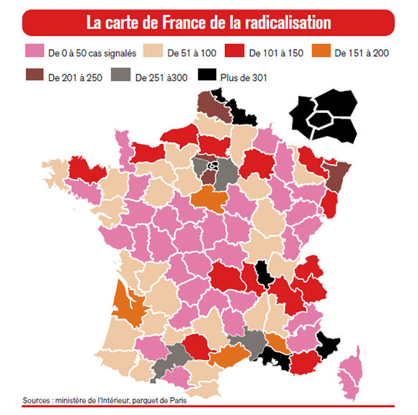
```
]

---
class: animated, fadeIn
## Les données en cartographie

<div class="my-footer"><span>Université Paris 1 Panthéon Sorbonne - M1 `r annee` : cartographie et statistique - Florian Bayer</span></div> 

.center-img[
```{r echo=FALSE, out.width="50%"}
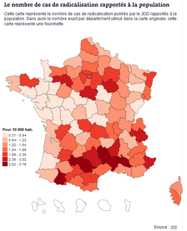
```
]]

---
class: animated, fadeIn
## Le langage cartographique

<div class="my-footer"><span>Université Paris 1 Panthéon Sorbonne - M1 `r annee` : cartographie et statistique - Florian Bayer</span></div> 

--

- alphabet

.zoom[ .center-img[
```{r echo=FALSE, out.width="40%"}

```
] ]

--

___ 

- vocabulaire

.zoom[ .center-img[
```{r echo=FALSE, out.width="70%"}

```
] ]

--

___

- syntaxe (sémiologie graphique)

.zoom[ .center-img[
```{r echo=FALSE, out.width="40%"}
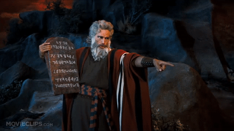
```
] ]

---
class: animated, fadeIn
## La sémiologie graphique

<div class="my-footer"><span>Université Paris 1 Panthéon Sorbonne - M1 `r annee` : cartographie et statistique - Florian Bayer</span></div> 

.pull-left[
La sémiologie graphique est basée sur la manière dont le lecteur **perçoit au mieux** la transcription graphique de données quantitatives et qualitatives. Elle a été développée dans les années 60 par **Jacques Bertin**
- Il s’agit donc de règles optimales de transmission de messages, basée sur des propriétés physiologiques.  
- La bonne utilisation de ces règles est indispensable afin d’avoir un message cartographique **clair et objectif**
]

.center-img[.pull-right[
```{r echo=FALSE, out.width="100%"}
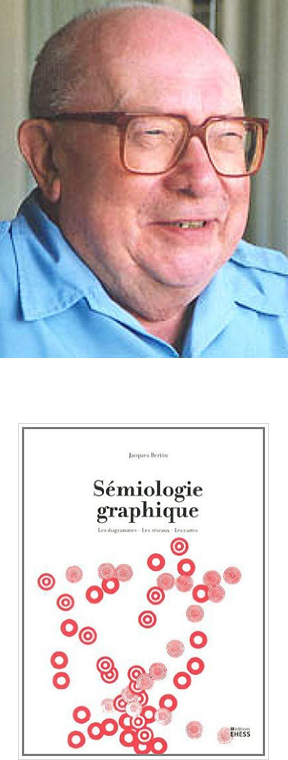
```
]]

---
class: animated, fadeIn
## La sémiologie graphique

<div class="my-footer"><span>Université Paris 1 Panthéon Sorbonne - M1 `r annee` : cartographie et statistique - Florian Bayer</span></div> 

.center-img[
```{r echo=FALSE, out.width="100%"}
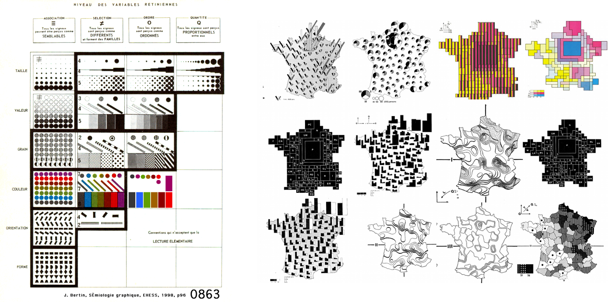
```
]

---
class: inverse, center, middle, animated, fadeIn  
# 2- Implantation et figuration


<div class="my-footer-title "></div> 

---
class: animated, fadeIn
## Définition
<div class="my-footer"><span>Université Paris 1 Panthéon Sorbonne - M1 `r annee` : cartographie et statistique - Florian Bayer</span></div> 

Avant de construire une carte, il faut anticiper l’implantation et la figuration de la donnée. 
- La **localisation** : l’emplacement des objets/lieux à la surface de la Terre. **Notion géographique**.
- L’**implantation** : la transcription **graphique** d’un objet géographique sur la carte (point, ligne ou surface). **Notion cartographique**.
- La **figuration** : La manière de **représenter graphiquement** l’information en fonction de l’implantation (ponctuel, linéaire, zonal). **Notion carto-graphique.**

--

>- L’implantation va dépendre des objets géographiques étudiés et de l’échelle de la carte.
>- La figuration dépendra de la variable visuelle et donc du type de données porté par les objets géographiques.

---
class: animated, fadeIn
## Implantation
Comment vais je disposer mon élément graphique sur ma carte ? 
.center-img[
```{r echo=FALSE, out.height="500"}
data(World, rivers)

Afrique <- World %>% filter(continent=="Africa")
tmap_mode("plot")

style = "natural"

map_point <- tm_shape(Afrique) + tm_fill() +
    tm_shape(World) + tm_fill() +
    tm_shape(World) + tm_bubbles(size = 0.15, col = "grey50")+
    tm_style(style, title = "Implantation ponctuelle") +
    tm_format("World")

map_ligne <- tm_shape(Afrique) + tm_fill() +
    tm_shape(World) +tm_fill() +
    tm_shape(rivers) + tm_lines(col="grey50", lwd=1, scale=2, legend.lwd.show = FALSE) +
    tm_style(style, title = "Implantation linéaire") +
    tm_format("World")

map_surface <- tm_shape(Afrique) + tm_fill() + 
    tm_shape(World) + tm_fill() + tm_borders('grey50')+
    tm_style(style, title = "Implantation surfacique") +
    tm_format("World")

tmap_arrange(map_point, map_ligne,map_surface,ncol =3)

```
]

<div class="my-footer"><span>Université Paris 1 Panthéon Sorbonne - M1 `r annee` : cartographie et statistique - Florian Bayer</span></div> 

---
class: animated, fadeIn
## Figuration
La manière de représenter graphiquement les données, Elle est indépendante de l’implantation, même si elle se construit également à partir des 3 formes élémentaires : 

- Figuré ponctuel
- Figuré linéaire
- Figuré zonal

<div class="my-footer"><span>Université Paris 1 Panthéon Sorbonne - M1 `r annee` : cartographie et statistique - Florian Bayer</span></div> 

---
class: animated, fadeIn
## Figuré ponctuel
.center-img[
```{r echo=FALSE, out.height="550"}

map_point_point <- tm_shape(Afrique) + tm_fill() +
    tm_shape(World) + tm_fill() +
    tm_shape(World) + tm_symbols(shape = "continent", col = "continent",legend.shape.show = FALSE,legend.col.show = FALSE)+
    tm_style(style, title = "Impl. ponctuelle, fig. ponctuel") +
    tm_format("World")

map_ligne_point <- tm_shape(Afrique) + tm_fill() +
    tm_shape(World) +tm_fill() +
    #tm_shape(rivers) + tm_lines(col="grey50", lwd="scalerank", scale=2, legend.lwd.show = FALSE) +
    tm_style(style="bw", title = "Impl. linéaire, fig. ponctuel") +
    tm_format("World")

map_surface_point <- tm_shape(Afrique) + tm_fill() + 
    tm_shape(World) + tm_fill() + tm_borders('grey50')+
    tm_shape(World) + tm_bubbles(size = "pop_est", scale = 3,legend.max.symbol.size = , col = "grey50", legend.size.show = FALSE)+
    tm_style(style, title = "Impl. surfacique, fig. ponctuel") +
    tm_format("World")

tmap_arrange(map_point_point, map_ligne_point,map_surface_point,ncol =3)
```
]

<div class="my-footer"><span>Université Paris 1 Panthéon Sorbonne - M1 `r annee` : cartographie et statistique - Florian Bayer</span></div> 

---
class: animated, fadeIn
## Figuré linéaire
.center-img[
```{r echo=FALSE, out.height="550"}

map_point_ligne <- tm_shape(Afrique) + tm_fill() +
    tm_shape(World) + tm_fill() +
    #tm_shape(World) + tm_symbols(shape = "continent", col = "continent",legend.shape.show = FALSE,legend.col.show = FALSE)+
    tm_style(style="bw", title = "Impl. ponctuelle, fig. linéaire") +
    tm_format("World")

map_ligne_ligne <- tm_shape(Afrique) + tm_fill() +
    tm_shape(World) +tm_fill() +
    tm_shape(rivers) + tm_lines(col="name", lwd=2, scale=2, legend.col.show = FALSE) +
    tm_style(style, title = "Impl. linéaire, fig. linéaire") +
    tm_format("World")

map_surface_ligne <- tm_shape(Afrique) + tm_fill() + 
    tm_shape(World) + tm_fill() + tm_borders('grey50')+
    #tm_shape(World) + tm_bubbles(size = "pop_est", scale = 3,legend.max.symbol.size = , col = "grey50", legend.size.show = FALSE)+
    tm_style(style="bw", title = "Impl. surfacique, fig. linéaire") +
    tm_format("World")

tmap_arrange(map_point_ligne, map_ligne_ligne,map_surface_ligne,ncol =3)
```
]

<div class="my-footer"><span>Université Paris 1 Panthéon Sorbonne - M1 `r annee` : cartographie et statistique - Florian Bayer</span></div> 

---
class: animated, fadeIn
## Figuré zonal

.center-img[
```{r echo=FALSE, out.height="550"}

map_point_zonal <- tm_shape(Afrique) + tm_fill() +
    tm_shape(World) + tm_fill() +
    tm_shape(World %>% filter(iso_a3 %in% c("EGY","BEN"))) + tm_bubbles(size = 10, alpha = 0) +
    tm_shape(World %>% filter(iso_a3 %in% c("EGY","BEN"))) + tm_bubbles(size = 3, alpha = 0)+
    tm_shape(World %>% filter(iso_a3 %in% c("EGY","BEN"))) + tm_bubbles(size = 0.1, alpha = 0)+
    tm_style(style, title = "Impl. ponctuelle, fig. zonal : buffer") +
    tm_format("World")

map_ligne_zonal <- tm_shape(Afrique) + tm_fill() +
    tm_shape(World) +tm_fill() +
    tm_shape(rivers) + tm_lines(lwd="strokelwd", scale=30, legend.lwd.show = FALSE) +
    tm_style(style, title = "Impl. linéaire, fig. zonal : bassin versant") +
    tm_format("World")

map_surface_zonal <- tm_shape(Afrique) + tm_fill() + 
    tm_shape(World) + tm_fill() + tm_borders('grey50')+
    tm_shape(World) + tm_polygons("HPI",legend.show = FALSE)+
    tm_style(style, title = "Impl. surfacique, fig. zonal") +
    tm_format("World")

tmap_arrange(map_point_zonal, map_ligne_zonal,map_surface_zonal,ncol =3)
```
]

<div class="my-footer"><span>Université Paris 1 Panthéon Sorbonne - M1 `r annee` : cartographie et statistique - Florian Bayer</span></div> 

---
class: inverse, center, middle, animated, fadeIn
# 3- Les variables visuelles


<div class="my-footer-title "></div> 

---
class: animated, fadeIn
## Principes
<div class="my-footer"><span>Université Paris 1 Panthéon Sorbonne - M1 `r annee` : cartographie et statistique - Florian Bayer</span></div> 

En cartographie, on cherche à faire varier des figurés pour transmettre une information : les variables visuelles

--

Il s’agit des moyens graphiques pour représenter l’information. 
>- Elles forment le vocabulaire du langage graphique. 
>- Elles traduisent visuellement un texte ou une série de données.

.zoom[ .center-img[
```{r echo=FALSE, out.width="100%"}
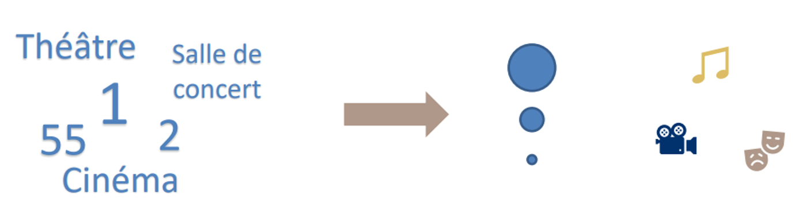
```
]]

---
class: animated, fadeIn
## Principes
<div class="my-footer"><span>Université Paris 1 Panthéon Sorbonne - M1 `r annee` : cartographie et statistique - Florian Bayer</span></div> 

.pull-left1[
Il en existe 4 principales (physiologiques) 
>- La valeur
>- La forme
>- La taille
>- La couleur

Et 3 secondaires (construites)
>- La texture
>- L’orientation
>- Le grain/la graisse

]

.zoom[.center-img[.pull-right3[
```{r echo=FALSE, out.width="100%"}
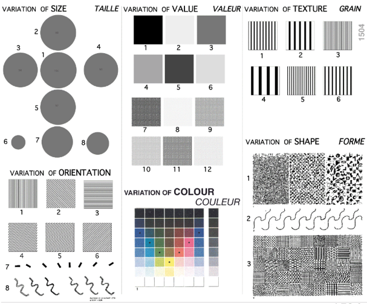
```
]]]

---
class: animated, fadeIn
## Principes
<div class="my-footer"><span>Université Paris 1 Panthéon Sorbonne - M1 `r annee` : cartographie et statistique - Florian Bayer</span></div> 

Toutes ont des **propriétés** et ne transmettent pas la même information. On dit que les variables visuelles offrent des possibilités de **différentiation visuelle** :

.zoom[.center-img[
```{r echo=FALSE, out.width="100%"}
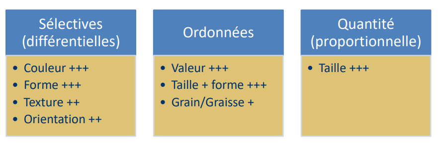
```
]]

C'est pour cela qu'elles sont **dépendantes du type de données** en amont.

---
class: animated, fadeIn
## Autres propriétés

Les variables visuelles ont toutes une **longueur** spécifique :
- le nombre de variations possibles que le lecteur est capable de percevoir. 
- La longueur d'une varibale visuelle dépend aussi de l'implantation (plus grande en implantation zonale que ponctuelle ou linéaire).

De plus, il est possible de **combiner** plusieurs variables visuelles pour renforcer le message ou transmettre deux informations.

<div class="my-footer"><span>Université Paris 1 Panthéon Sorbonne - M1 `r annee` : cartographie et statistique - Florian Bayer</span></div> 


---
class: inverse, center, middle, animated, fadeIn
# La couleur


<div class="my-footer-title "></div> 

---
class: animated, fadeIn
## La couleur : définition

La couleur est composée de 3 éléments: 
- La teinte (nuance/ton) : l’interprétation par l’œil de l’ensemble des radiations renvoyées par un objet éclairé en lumière blanche. C’est la forme pure d’une couleur, sans ajout de blanc ou de noir
- L’intensité (valeur) : l’intensité lumineuse de la couleur (clair au sombre)
- La saturation (pureté de la couleur) : la « vivacité » de la couleur. Plus elle est saturée, plus elle tend vers le gris 

.zoom[.center-img[
```{r echo=FALSE, out.width="80%"}
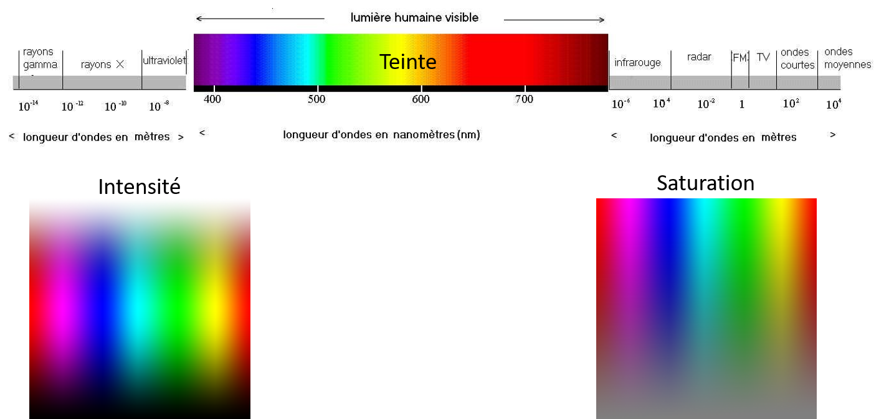
```
]]


<div class="my-footer"><span>Université Paris 1 Panthéon Sorbonne - M1 `r annee` : cartographie et statistique - Florian Bayer</span></div> 

---
class: animated, fadeIn
## La couleur : propriétés

**Propriétés**
- La couleur est **très sélective** et est facilement mémorisable par le lecteur 
- Elle est ordonnée **uniquement** de part et d’autre du spectre du visible (jaune = neutre) et seulement sur 2 couleurs (chaude – froide)

**Utilisation**
- Il s’agit de la meilleure manière de mettre en évidence divers natures d’objets
- Elle dépend toutefois des moyens d’impressions et d’édition 

**Longueur**
- 5 à 10 (très efficace en implantation zonale)

<div class="my-footer"><span>Université Paris 1 Panthéon Sorbonne - M1 `r annee` : cartographie et statistique - Florian Bayer</span></div>

---
class: animated, fadeIn
## La couleur : remarques

L’interprétation des couleurs est **très subjective** : à votre niveau, éviter associer une couleur selon votre propre interprétation, sauf règles conventionnelles : forêt en vert, océan en bleu. 

Le choix des couleurs doit donc être mûrement réfléchi : la différence doit être visible entre les couleurs et elles doivent être harmoniques. Des sites peuvent vous aider ([Colorbrewer](http://colorbrewer2.org/#type=qualitative&scheme=Pastel1&n=7), [coolors](https://coolors.co/browser/best/1)).

Il faut éviter les oppositions rouge-bleu en implantation zonale.

Le jaune est une couleur difficile à maitriser car elle « diffuse » c’est-à-dire que l’œil à tendance à la mélanger avec les couleurs voisines.

.zoom[.center-img[
```{r echo=FALSE, out.width="10%"}
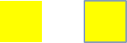
```
]]

<div class="my-footer"><span>Université Paris 1 Panthéon Sorbonne - M1 `r annee` : cartographie et statistique - Florian Bayer</span></div>

---
class: animated, fadeIn
## La couleur : exemples

<div class="my-footer"><span>Université Paris 1 Panthéon Sorbonne - M1 `r annee` : cartographie et statistique - Florian Bayer</span></div> 

.center-img[.pull-left[
```{r echo=FALSE, out.width="100%"}
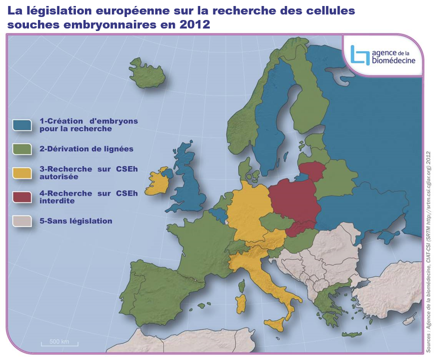
```
]


.pull-right[
```{r echo=FALSE, out.width="100%"}
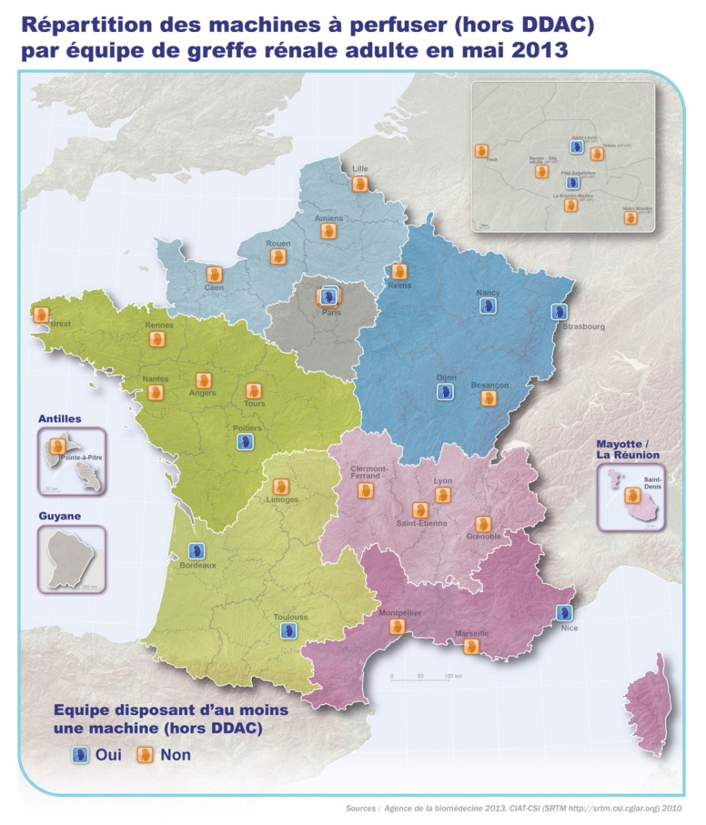
```
]]


---
class: inverse, center, middle, animated, fadeIn
# La valeur


<div class="my-footer-title "></div> 

---
class: animated, fadeIn
## La valeur : définition

*"Le rapport entre la quantité de noir et de blanc perçues sur une surface données" (J. Bertin)*
- Elle peut être en applat, du blanc vers le noir en passant par une infinité de gris
- Elle peut aussi prendre la forme d'une trame où les quantités de blanc et de noir évoluent à l'inverse

.zoom[.center-img[
```{r echo=FALSE, out.width="70%"}
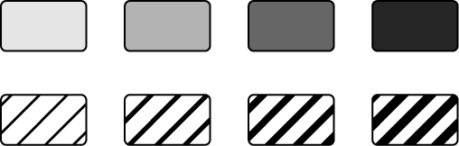
```
]]


<div class="my-footer"><span>Université Paris 1 Panthéon Sorbonne - M1 `r annee` : cartographie et statistique - Florian Bayer</span></div> 

---
class: animated, fadeIn
## La valeur : propriétés

**Propriétés**
- La valeur traduit avant tout une notion d'**ordre**

**Utilisation**
- Pour les données **quantitatives de taux** (il faut discrétiser la série statistique)
- Mais aussi pour les données **qualitatives ordinales**

**Longueur**
- Implantation zonale : 8 à 9 paliers
- Implantation ponctuelle et linéaire : 4 à 5 paliers


<div class="my-footer"><span>Université Paris 1 Panthéon Sorbonne - M1 `r annee` : cartographie et statistique - Florian Bayer</span></div>

---
class: animated, fadeIn
## La valeur : remarque 1

Il faut éviter d’utiliser le blanc comme valeur de départ dans la légende, car il peut être utiliser pour signifier l’absence de données. Un noir à 3% ou 5% (gris très clair) est préférable

L’œil distingue mieux de faibles nuances dans les valeurs claires que dans les valeurs foncées. Il ne faut donc pas créer des montées en valeur équidistante:

.zoom[.center-img[
```{r echo=FALSE, out.width="100%"}
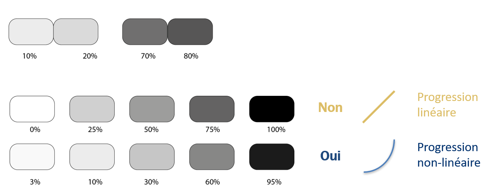
```
]]

<div class="my-footer"><span>Université Paris 1 Panthéon Sorbonne - M1 `r annee` : cartographie et statistique - Florian Bayer</span></div>

---
class: animated, fadeIn
## La valeur : remarque 2

Il est possible de combiner la valeur à UNE couleur : un **camaïeu**
- On passera toujours par des niveaux de gris, mais combiné avec une teinte
- Pour cela, il faut jouer sur la saturation de la couleur, en **gardant le même ton.**

.zoom[.center-img[
```{r echo=FALSE, out.width="70%"}

```
]]

Il est également possible de réaliser une **gradation harmonique** dans les tons chauds (jaune vers le rouge) ou les tons froids (moins pertinent). Il faut alors jouer sur la valeur (plus faible pour le jaune, plus foncé pour le rouge)

.zoom[.center-img[
```{r echo=FALSE, out.width="90%"}
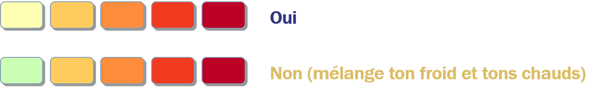
```
]]


<div class="my-footer"><span>Université Paris 1 Panthéon Sorbonne - M1 `r annee` : cartographie et statistique - Florian Bayer</span></div>


---
class: animated, fadeIn
## La valeur : remarque 3

Il est possible de réaliser une *double progression de valeur* de part et d’autre d’un centre : une **montée de valeur en double progression inversée**. 

- La classe centrale aura une couleur neutre : blanc cassé, jaune pâle. Il faut éviter les oppositions bleu/rouge
- Uniquement pour des valeurs avec oppositions (inférieur et supérieur à 0)

.zoom[.center-img[
```{r echo=FALSE, out.width="70%"}
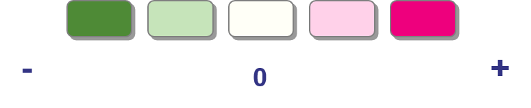
```
]]

<div class="my-footer"><span>Université Paris 1 Panthéon Sorbonne - M1 `r annee` : cartographie et statistique - Florian Bayer</span></div>

---
class: animated, fadeIn
## La valeur : exemples

<div class="my-footer"><span>Université Paris 1 Panthéon Sorbonne - M1 `r annee` : cartographie et statistique - Florian Bayer</span></div> 

.center-img[.pull-left[
```{r echo=FALSE, out.width="100%"}
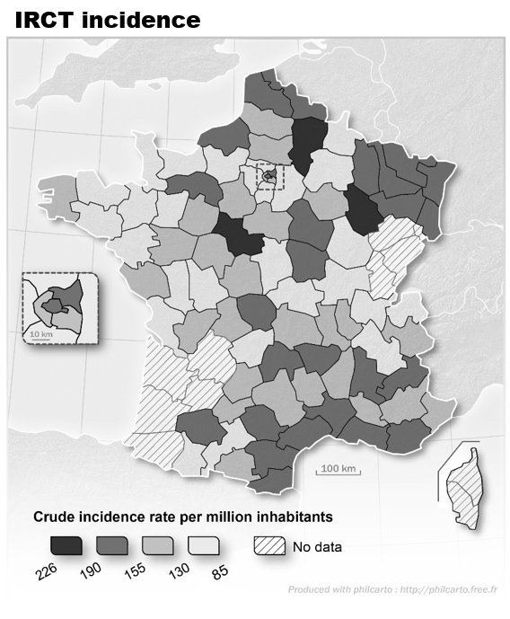
```
]

.pull-right[
```{r echo=FALSE, out.width="100%"}
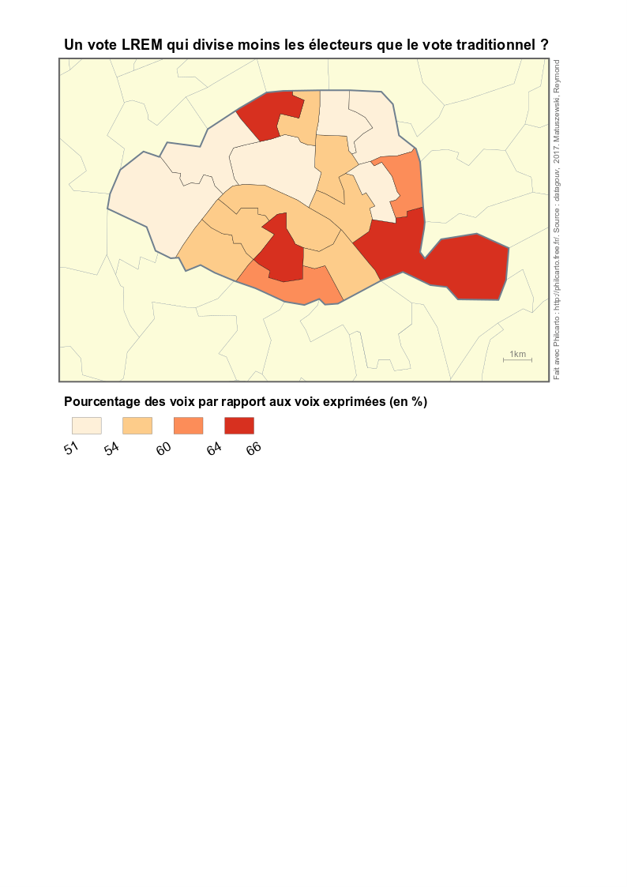
```
]]

---
class: animated, fadeIn
## La valeur : exemples

<div class="my-footer"><span>Université Paris 1 Panthéon Sorbonne - M1 `r annee` : cartographie et statistique - Florian Bayer</span></div> 

.center-img[.pull-left[
```{r echo=FALSE, out.width="80%"}
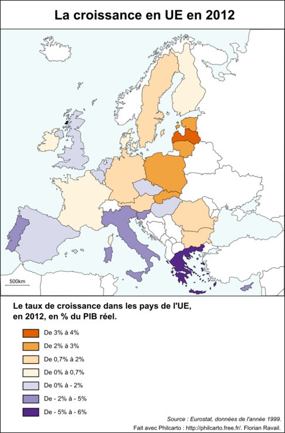
```
]

.pull-right[
```{r echo=FALSE, out.width="100%"}
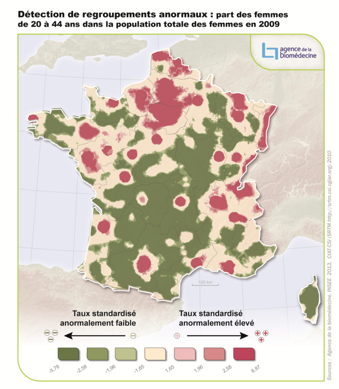
```
]]


---
class: inverse, center, middle, animated, fadeIn
# La taille


<div class="my-footer-title "></div> 

---
class: animated, fadeIn
## La taille : définition

La variation proportionnelle de la surface, de la hauteur ou de la longueur d’un figuré

- La taille doit se combiner à une forme (simple de préférence).
- Pour les données de stock, la variation de la superficie de la forme **doit être proportionnelle** à la valeur de la donnée à représenter. L’objectif est de traduire la propriété de cumul des effectifs des variables de stock.
- Pour les données de stock : l’utilisateur doit être capable de recalculer les données exactes à partir de la carte.

.zoom[.center-img[
```{r echo=FALSE, out.width="80%"}

```
]]


<div class="my-footer"><span>Université Paris 1 Panthéon Sorbonne - M1 `r annee` : cartographie et statistique - Florian Bayer</span></div> 

---
class: animated, fadeIn
## La taille : propriétés

**Propriétés et utilisation**

- Pour les données de **stock**, c'est la seule variabe traduisant une notion de **proportionnalité** (une valeur de 100 a une superficie deux fois plus importante qu'un cercle de valeur 50)
- Pour les données qualitatives ordinales, elle peut également traduire une notion d'**ordre** (petit, moyen, grand)

**Longueur**
- Théoriquement infinie, mais limité par le plus petit point visible par l’œil (0,2mm) et la place disponible sur la carte (sans gêner la lecture).

<div class="my-footer"><span>Université Paris 1 Panthéon Sorbonne - M1 `r annee` : cartographie et statistique - Florian Bayer</span></div>

---
class: animated, fadeIn
## La taille : remarque 1 

La taille traduit généralement une série de donnée de façon continue (un figuré par valeur).

Si le nombre d’individus est trop important, il est possible de discrétiser la série (très pratique pour montrer une hiérarchie ou une chronologie) :
- Les proportionnalités se calculent alors soit sur le centre des classes, les bornes inférieures ou supérieures.

Il faut éviter d’ajouter un effet de volume sur le figuré (perte de repère pour le lecteur).

<div class="my-footer"><span>Université Paris 1 Panthéon Sorbonne - M1 `r annee` : cartographie et statistique - Florian Bayer</span></div>

---
class: animated, fadeIn
## La taille : remarque 2 

Pourquoi utiliser la valeur uniquement sur les variables de taux ?

- Les variations de taille sont facilement perçues par l’œil et sont immédiatement identifiées comme des rapports de proportionnalités entre des effectifs. 
- Cette variable est la seule qui traduise **efficacement une quantité.**

.center-img[.pull-left[
```{r echo=FALSE, out.width="70%"}
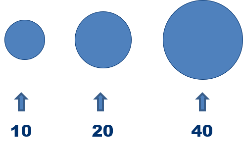
```

Le lecteur perçoit immédiatement les rapports de proportionnalité et d’ordre.
Un ou deux allers et retours avec la légende suffisent à assimiler précisément l’information statistique.

]


.pull-right[
```{r echo=FALSE, out.width="70%"}
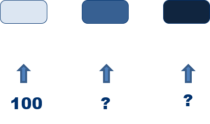
```

Le lecteur perçoit uniquement le rapport d’ordre.
De nombreux aller-retour avec la légende sont nécessaires pour assimiler une information moins détaillés (discrétisée).

]]

<div class="my-footer"><span>Université Paris 1 Panthéon Sorbonne - M1 `r annee` : cartographie et statistique - Florian Bayer</span></div>

---
class: animated, fadeIn
## La taille : exemples

<div class="my-footer"><span>Université Paris 1 Panthéon Sorbonne - M1 `r annee` : cartographie et statistique - Florian Bayer</span></div> 

.center-img[.pull-left[
```{r echo=FALSE, out.width="100%"}
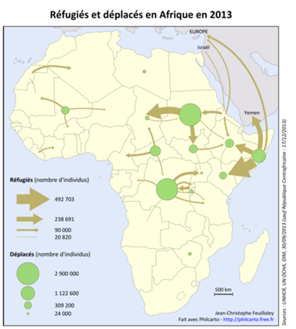
```
]

.pull-right[
```{r echo=FALSE, out.width="100%"}
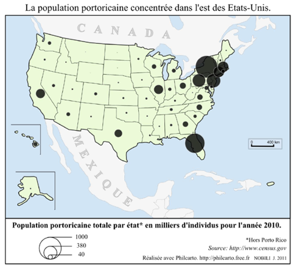
```
]]

---
class: animated, fadeIn
## La taille : exemples

<div class="my-footer"><span>Université Paris 1 Panthéon Sorbonne - M1 `r annee` : cartographie et statistique - Florian Bayer</span></div> 

.center-img[.pull-left[
```{r echo=FALSE, out.width="80%"}
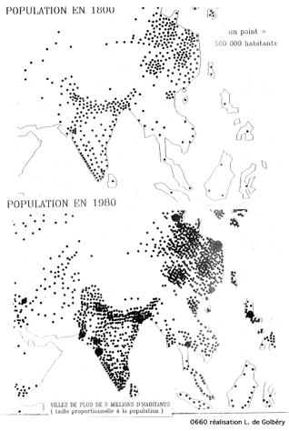
```
]

.pull-right[
```{r echo=FALSE, out.width="80%"}
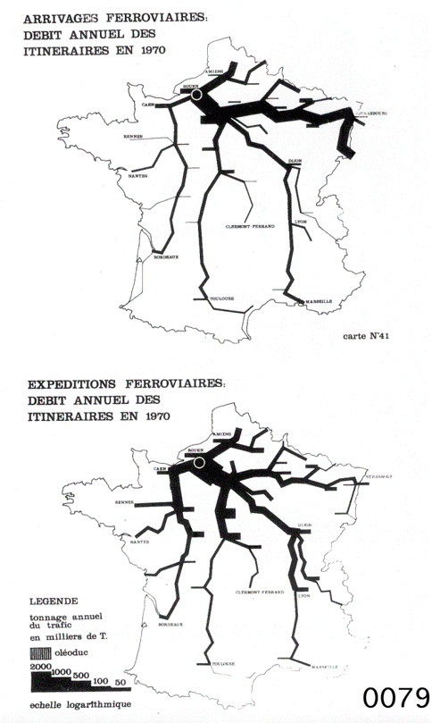
```
]]


---
class: animated, fadeIn
## Construction manuelle

On sait que : $Surface\ du\ cercle = \pi \times Rayon^2$ 

$\pi$ s’appliquera à tous les calculs sans jamais varier. C’est donc une constante qui peut-être éliminée pour nos calculs.

Donc : $Rayon = \sqrt{surface\ du\ cercle}$    

Alors :  $Rayon = \sqrt{valeur\ à\ représenter}$

Exemple : si on doit représenter une valeur de 100 et une de 25, le rayon des deux cercles sera $\sqrt{100} = 10$ et $\sqrt{25} = 5$ 

Dans certains cas, les cercles sont trop petits sur la carte. Il est alors possible d’ajouter une constante **k** pour augmenter le rayon du cercle. Cette constante doit évidemment s’appliquer à tous les cercles. On obtient donc : 

$Rayon = \sqrt{valeur\ à\ représenter} \times k$

<div class="my-footer"><span>Université Paris 1 Panthéon Sorbonne - M1 `r annee` : cartographie et statistique - Florian Bayer</span></div>

---
class: animated, fadeIn
## Récupérer la valeur exacte d’un cercle

Comme : $Rayon = \sqrt{valeur\ à\ représenter} \times k$

Alors : $Valeur\ recherchée = (\frac{rayon}{constante})^2$

Le problème est de déterminer la *constante*. Pour cela, il faut s’appuyer sur la légende. 
1. On mesure le diamètre d’un des cercles de la légende. On obtient par exemple un diamètre de 50mm (donc un rayon de 25mm) pour une valeur de 1000.
2. On obtient la constante *k* en divisant le rayon par la racine de la valeur, soit dans l’exemple : $k = \frac{25}{\sqrt{1000}}$
3. Donc $k = 0,79056942$
4. On vérifie notre égalité : $(\frac{25}{0,79056942})^2 = 1000$ (à l’arrondi prêt)
5. Donc dans l’exemple, pour trouver la valeur d’un cercle proportionnel sur la carte, l’équation sera : $Valeur\ recherchée = (\frac{rayon\ du\ cercle}{0,79056942})^2$

Il est évidemment conseillé d’utiliser dans le calcul $\frac{25}{\sqrt{1000}}$ plutôt que $0,79056942$

Il est conseillé de valider la constante $k$ en se basant sur un second cercle de la légende.


<div class="my-footer"><span>Université Paris 1 Panthéon Sorbonne - M1 `r annee` : cartographie et statistique - Florian Bayer</span></div>

---
class: inverse, center, middle, animated, fadeIn
# La forme


<div class="my-footer-title "></div> 

---
class: animated, fadeIn
## La forme : définition

La variation des contours d'un figuré. Il peut s'agir de figurés : 
- géométriques (carré, cercle, triangle) 
- ou de pictogrammes (symbole)

Certains considère que la forme et la texture (voir définition suivante) sont la même variables, la seconde étant la forme en implantation zonale.

.zoom[.center-img[
```{r echo=FALSE, out.width="100%"}
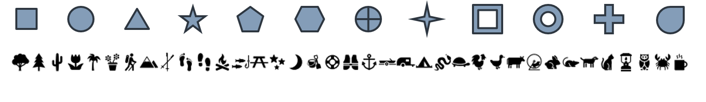
```
]]

<div class="my-footer"><span>Université Paris 1 Panthéon Sorbonne - M1 `r annee` : cartographie et statistique - Florian Bayer</span></div> 

---
class: animated, fadeIn
## La forme : propriétés

**Propriétés**

- Utilisée seule, la forme est très **sélective**
- Mais elle peut être facilement combinée avec d'autres variables visuelles :
  * Taille + Forme
  * Avec la couleur pour renforcer l'idée de différence

**Utilisation**

- Seule : pour les données de **qualitatives nominales**

**Longueur**
- Théoriquement infinie, mais 7 reste un maximum optimal


<div class="my-footer"><span>Université Paris 1 Panthéon Sorbonne - M1 `r annee` : cartographie et statistique - Florian Bayer</span></div>

---
class: animated, fadeIn
## La forme : remarques

<div class="my-footer"><span>Université Paris 1 Panthéon Sorbonne - M1 `r annee` : cartographie et statistique - Florian Bayer</span></div>

Il est conseillé d’utiliser des formes simples :

.zoom[.center-img[
```{r echo=FALSE, out.width="40%"}

```
]]

--

Si les symboles sont petits, il ne faut pas mélanger des formes que l’œil risque de confondre :

.zoom[.center-img[
```{r echo=FALSE, out.width="10%"}

```
]]

--

Dans ce cas, il est préférable d’utiliser des formes de hauteur et largeur variable :

.zoom[.center-img[
```{r echo=FALSE, out.width="8%"}

```
]]

--

L’utilisation des pictogrammes doit se faire avec modération et de manière adéquate : 

.zoom[.center-img[
```{r echo=FALSE, out.width="100%"}

```
]]

---
class: animated, fadeIn
## La forme : exemples

<div class="my-footer"><span>Université Paris 1 Panthéon Sorbonne - M1 `r annee` : cartographie et statistique - Florian Bayer</span></div> 

.center-img[.pull-left[
```{r echo=FALSE, out.width="100%"}
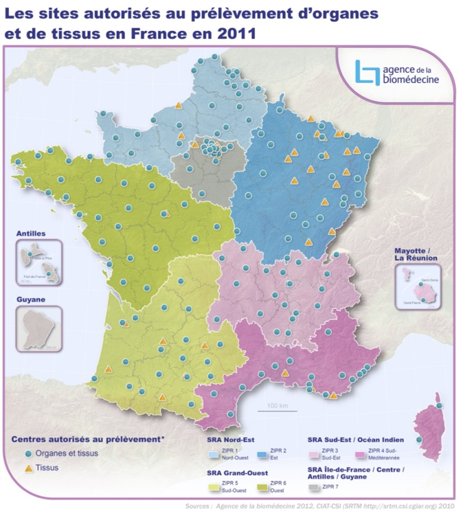
```
]

.pull-right[
```{r echo=FALSE, out.width="100%"}
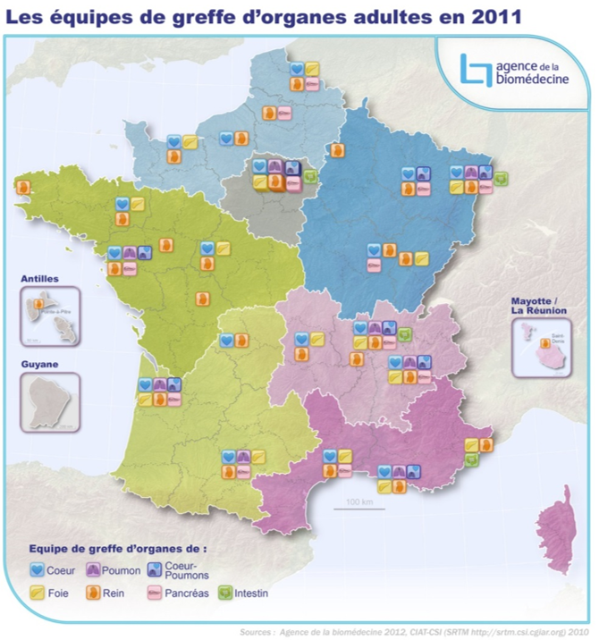
```
]]

---
class: inverse, center, middle, animated, fadeIn
# La texture - structure


<div class="my-footer-title "></div> 

---
class: animated, fadeIn
## La texture - structure : définition

La répétition d’un motif sur un figuré. Elle peut  être facilement combinée avec d’autres variables comme la couleur (couverture végétale)

.zoom[.center-img[
```{r echo=FALSE, out.width="50%"}

```
]]

<div class="my-footer"><span>Université Paris 1 Panthéon Sorbonne - M1 `r annee` : cartographie et statistique - Florian Bayer</span></div> 

---
class: animated, fadeIn
## La texture - structure : propriétés

**Propriétés**

- Seule : est elle est **sélective**
- Combiné avec la valeur, elle est **ordonnée**
- La seule variable visuelle permettant de transmettre une information **qualitative en implantation zonale en noir et blanc**

**Utilisation** 

- Seule : pour des données **qualitatives nominales**. Dans ce cas, il faut veiller à garder le même rapport noir/blanc si on utilise plusieurs textures.
- Avec la valeur : pour des données **quantitatives de taux** ou **qualitatives ordinales**. Permet de faire facilement des montées de valeur manuelles et des doubles gammes inversées en noir et blanc

**Longueur**
- 4 à 5 paliers

<div class="my-footer"><span>Université Paris 1 Panthéon Sorbonne - M1 `r annee` : cartographie et statistique - Florian Bayer</span></div>

---
class: animated, fadeIn
## La texture - structure : exemples

<div class="my-footer"><span>Université Paris 1 Panthéon Sorbonne - M1 `r annee` : cartographie et statistique - Florian Bayer</span></div> 

.center-img[.pull-left[
```{r echo=FALSE, out.width="100%"}
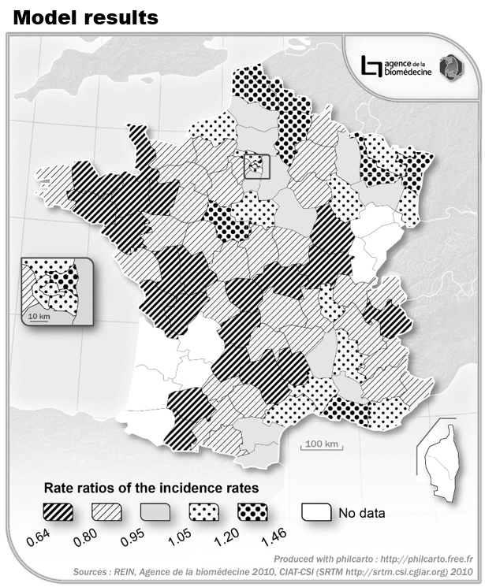
```
]

.pull-right[
```{r echo=FALSE, out.width="100%"}
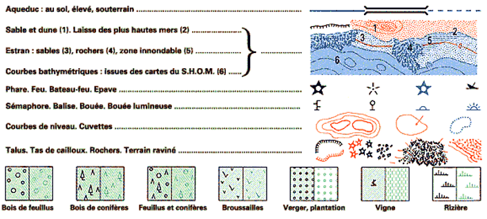
```
]]

---
class: inverse, center, middle, animated, fadeIn
# noitatneiro'L


<div class="my-footer-title "></div> 

---
class: animated, fadeIn
## L'orientation : définition

La variation de l’angle d’une forme ou d’une texture par rapport à un axe


.zoom[.center-img[
```{r echo=FALSE, out.width="50%"}
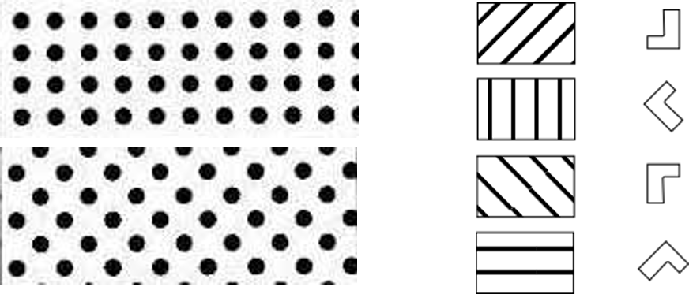
```
]]

<div class="my-footer"><span>Université Paris 1 Panthéon Sorbonne - M1 `r annee` : cartographie et statistique - Florian Bayer</span></div> 

---
class: animated, fadeIn
## L'orientation : propriétés

**Propriétés**

- Elle est **sélective**, mais doit être combiné avec la forme ou la texture

**Utilisation**

- Pour des données **qualitatives nominales**.
- Il faut éviter les traits verticaux (vibrations) et utiliser des variations d’angles de 45°

**Longueur**	
- 4 paliers

<div class="my-footer"><span>Université Paris 1 Panthéon Sorbonne - M1 `r annee` : cartographie et statistique - Florian Bayer</span></div>


---
class: inverse, center, middle, animated, fadeIn
# Le grain


<div class="my-footer-title "></div> 

---
class: animated, fadeIn
## Le grain / la graisse : définition

L’agrandissement ou la réduction d’une texture, **sans changer** le rapport entre le noir et le blanc 

.zoom[.center-img[
```{r echo=FALSE, out.width="50%"}
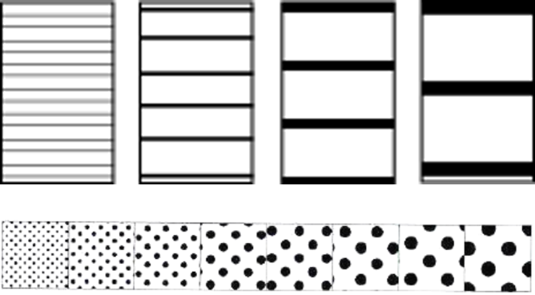
```
]]

<div class="my-footer"><span>Université Paris 1 Panthéon Sorbonne - M1 `r annee` : cartographie et statistique - Florian Bayer</span></div> 

---
class: animated, fadeIn
## Le grain / la graisse : propriétés

**Propriétés**

- Elle est **ordonnées**, mais doit être combiné avec la texture

**Utilisation** 

- Pour des données **qualitatives ordinales** ou **quantitatives de taux**.
- Pour transmettre une notion d’ordre, il faut aujourd'hui privilégier la variable valeur (aplat ou trame) plutôt que le grain 

**Longueur**
- 4 paliers, uniquement efficace en implantation zonale

<div class="my-footer"><span>Université Paris 1 Panthéon Sorbonne - M1 `r annee` : cartographie et statistique - Florian Bayer</span></div>

---
class: inverse, center, middle, animated, fadeIn  
# Conclusions


<div class="my-footer-title "></div> 

---
class: animated, fadeIn
## Concepts clés
<div class="my-footer"><span>Université Paris 1 Panthéon Sorbonne - M1 `r annee` : cartographie et statistique - Florian Bayer</span></div> 

La cartographie est un outil de **communication** basé sur la **représentation visuelle d’un message** par le langage graphique. 

Comme tous les langages, il dispose d’un **alphabet**, d'un **vocabulaire** et d’une **syntaxe** qui doivent être respectés pour éviter les erreurs de communication : les règles de **la sémiologie graphique**

La sémiologie graphique distingue 7 variables visuelles pour communiquer des notions :

- de **différence** (couleur, forme, texture, orientation)
- d'**ordre** (taille, valeur, grain)
- de **proportionnalité** (taille)

Ces variables visuelles dépendent des données en amont, qui transmettent les mêmes notions : 

- qualitatives nominales : **différence**
- qualitatives ordinales et quantitatives de taux : **ordre**
- quantitatives de stock : **proportionnalité**

---
class: animated, fadeIn
## Concepts clés
<div class="my-footer"><span>Université Paris 1 Panthéon Sorbonne - M1 `r annee` : cartographie et statistique - Florian Bayer</span></div> 

.zoom[.center-img[
```{r echo=FALSE, out.width="100%"}
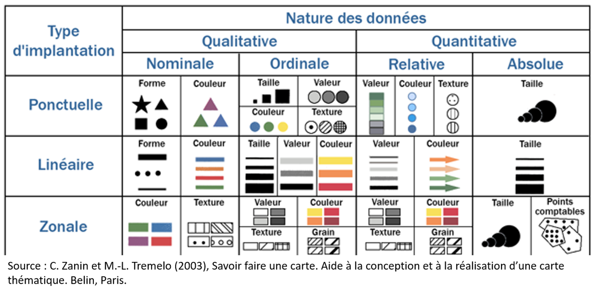
```
]]

---
class: animated, fadeIn
## Concepts clés
<div class="my-footer"><span>Université Paris 1 Panthéon Sorbonne - M1 `r annee` : cartographie et statistique - Florian Bayer</span></div> 

.zoom[.center-img[
```{r echo=FALSE, out.width="100%"}
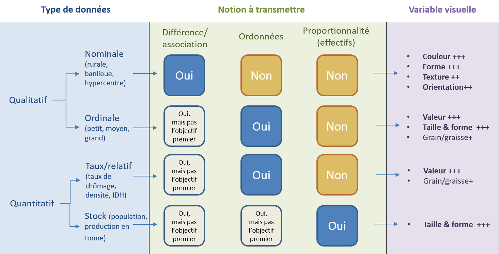
```
]]

