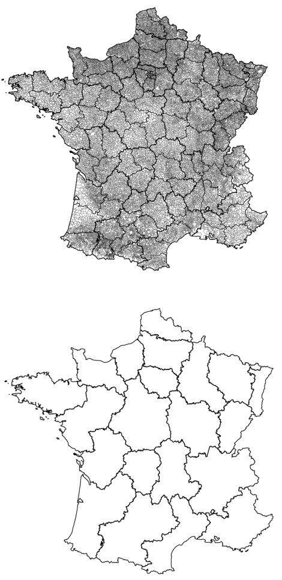
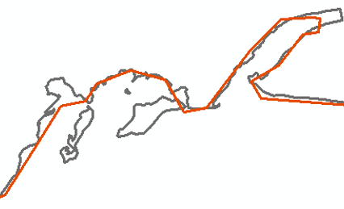
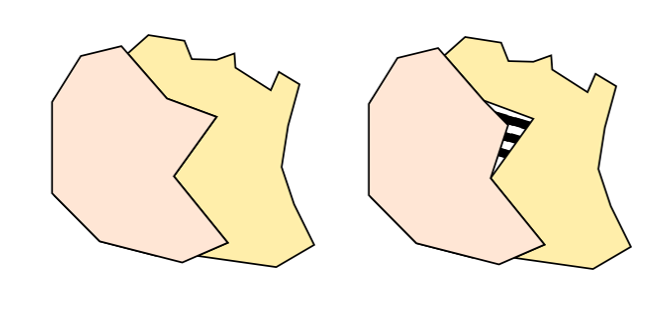

```{r setup, global_options,include=FALSE}
knitr::opts_chunk$set(
  dpi = 200,
  #fig.width = 7,
  #fig.height = 4,
  strip.white = T,
  #dev = "png",
  #dev.args = list(png = list(bg = "transparent")),
  message=FALSE,
  comment=NA,
  echo=FALSE,
  warning=FALSE,
  eval=TRUE
  
)
```

```{r include=FALSE}
source('./assets/functions.R')

# Les librairies
#devtools::install_github("ropenscilabs/rnaturalearth")
requiredPackages = c('knitr','dotenv')

PackageFacile(requiredPackages)

Plotly = TRUE
load_dot_env(".env")
annee=Sys.getenv("annee")

```


```{r data}
#source('./_ISRE2019_data.R')
#load_data()

```


class: center, middle, inverse, title-slide, animated, fadeIn
# Cartographie et statistique M1 `r annee`
# Cours n°4- les fonds de cartes: Projections et généralisation<br /> <br />
### Florian Bayer


<div class="my-footer"><span>Université Paris 1 Panthéon Sorbonne - M1 `r annee` : cartographie et statistique - Florian Bayer</span></div> 

---
class: animated, fadeIn
## Objectifs du cours
<div class="my-footer"><span>Université Paris 1 Panthéon Sorbonne - M1 `r annee` : cartographie et statistique - Florian Bayer</span></div> 

Rappels des précédents cours :

- Le cartographe doit **adapter** le message à son public et au support
- Tout en **facilitant** la transmission de ce message

--

Le travail sur le fond de carte est un des éléments permettant de satisfaire ces besoins.   
La création d'un fond de carte est un processus long, mais essentiel. La moindre erreur sera détectée par le lecteur et l'ajout de détails superflus perturbera la transmission du message cartographique.

--

Les objectifs de ce cours sont donc :

- de disposer de connaissances de bases sur les **projections cartographiques**
- d'apprendre à **généraliser** un fond de carte
- à l'aide d'un outil gratuit : Phildigit ou Qgis


---
class: animated, fadeIn
## Remarques
<div class="my-footer"><span>Université Paris 1 Panthéon Sorbonne - M1 `r annee` : cartographie et statistique - Florian Bayer</span></div> 

Avec l'essort des SIG, il est maintenant plus simple de trouver des fonds de cartes sur internet. Cependant, leur qualité est très variable et souvent très mal adaptée à de la cartographie d'édition. 

- Le SIG offre l'avantage de pouvoir **changer la projection** du fond carte facilement.
- Mais il faut souvent **retravailler** ce fond pour l'adapter au message.

--

Il arrive de ne pas avoir de fond de carte au format SIG, mais des cartes papiers (qu'il faudra scanner) ou des images peuvent se trouver. On créé alors le fond à l'aide d'un logiciel, comme un SIG, un logiciel de dessin (Illustrator, Inkscape) ou encore des outils spécifiques comme Phildigit.


---
class: animated, fadeIn
## Schéma de production

.zoom[ .center-img[
```{r echo=FALSE, out.width="100%"}
knitr::include_graphics("./images/1_Message/Image19.png")
```
] ]

<div class="my-footer"><span>Université Paris 1 Panthéon Sorbonne - M1 `r annee` : cartographie et statistique - Florian Bayer</span></div> 


---
class: inverse, center, middle, animated, fadeIn  
# 1- Les projections cartographiques


<div class="my-footer-title "></div> 

---
## Latitude et longitude

.zoom[ .center-img[
```{r echo=FALSE, out.width="80%"}

```
] ]

<div class="my-footer"><span>Université Paris 1 Panthéon Sorbonne - M1 `r annee` : cartographie et statistique - Florian Bayer</span></div> 

---
class: animated, fadeIn
## Postulat

La Terre à la forme d’une sphère aplatie au pôle (géoïde)   
On utilise généralement une **ellipsoïde** s’approchant le plus possible de la forme de la Terre pour la modéliser (Ex ellipsoïde de Clark).

.zoom[ .center-img[
```{r echo=FALSE, out.width="100%"}
knitr::include_graphics("./images/4-Fond/geoid.png")
```
] ]

La seule possibilité de représentation exacte est la construction d’un globe terrestre. Pour des raisons pratiques, cette représentation se fait en cartographie **sur un plan**. On y **projette** les coordonnées géographiques du globe.

<div class="my-footer"><span>Université Paris 1 Panthéon Sorbonne - M1 `r annee` : cartographie et statistique - Florian Bayer</span></div> 

---
class: animated, fadeIn
## Projection

.pull-left[
Sur un plan, une surface courbe ne peut pas être représentée sans **déformation**. Par conséquent, **toutes** les projections sur un plan déforment soit :
- Les surfaces
- Les angles
- Les deux

Le cartographe doit donc choisir la projection qui est la plus adaptée à son message et à sa zone d’étude
]

.center-img[.pull-right[
```{r echo=FALSE, out.width="100%"}

```

```{r echo=FALSE, out.width="100%"}

```

] ]


<div class="my-footer"><span>Université Paris 1 Panthéon Sorbonne - M1 `r annee` : cartographie et statistique - Florian Bayer</span></div> 

---
class: animated, fadeIn
## Se déplacer sur une carte

.pull-left[
Comme les angles ou les surfaces sont déformés, tracer une droite sur une carte ne revient pas toujours à prendre le chemin le plus court
- <span style="color:DarkBlue">Loxodromie</span> : cap coupant les méridiens sous le même angle
- <span style="color:DarkRed">Orthodromie</span> : chemin le plus court entre deux point d’une surface courbe

Par exemple pour une projection de Mercator (ci-contre) :
- à cap constant, on suit un chemin rectiligne sur la carte (loxodromie forme une droite),
- mais ce n’est pas le chemin le plus court (orthodromie).
]

.center-img[.pull-right[
```{r echo=FALSE, out.width="100%"}

```
]]

<div class="my-footer"><span>Université Paris 1 Panthéon Sorbonne - M1 `r annee` : cartographie et statistique - Florian Bayer</span></div> 


---
class: animated, fadeIn
## Classification : le plan de projection

Il est possible de différencier les projections en fonction de la forme de référence du plan de projection :

.center-img[
```{r echo=FALSE, out.width="100%"}

```
] 

<div class="my-footer"><span>Université Paris 1 Panthéon Sorbonne - M1 `r annee` : cartographie et statistique - Florian Bayer</span></div> 

---
class: animated, fadeIn
## Classification : le centre de projection (aspect)

On peut aussi les différencier en fonction des **pivots** de la forme de référence du plan :

- les deux pivots de la projection sont sur les *pôles* $\Rightarrow$ aspect **direct**
- les deux pivots de la projection sont sur l'*équateur* $\Rightarrow$ aspect **transverse**
- les deux pivots de la projection ne sont ni sur l'équateur ou le les pôles $\Rightarrow$ aspect **oblique**

.center-img[
```{r echo=FALSE, out.width="80%"}

```
] 

Pour que la projection se fasse avec une **minimum de déformation**, il faut faire en sorte que le centre de la projection se fasse **au niveau de la région étudiée**.

<div class="my-footer"><span>Université Paris 1 Panthéon Sorbonne - M1 `r annee` : cartographie et statistique - Florian Bayer</span></div> 

---
class: animad, fadeIn
## Classification : le point de vue
On peut enfin distinguer les projections en fonction du point de vue (origine)

.pull-left3[

Projection gnomonique (centrale) : le point de vue est au centre de la Terre
* Pas de représentation d’un hémisphère entier
* Le chemin le plus court entre deux point d’une surface courbe (**orthodromie**) est une droite sur la carte 

Projection orthographique : le point de vue est  à l’infinie
* Projection aphylactique (cf. infra Déformations)
* Représentation de plus d’un hémisphère

Projection stéréographique : le point de vue est  à l’opposé du globe 
* Projection conforme (cf. infra Déformations)
* Représentation de plus d’un hémisphère

]

.center-img[.pull-right1[
```{r echo=FALSE, out.width="70%"}

```

] ]

<div class="my-footer"><span>Université Paris 1 Panthéon Sorbonne - M1 `r annee` : cartographie et statistique - Florian Bayer</span></div> 

---
class: animated, fadeIn
## Classification : le point de vue

.center-img[
```{r echo=FALSE, out.width="100%"}

```
]

<div class="my-footer"><span>Université Paris 1 Panthéon Sorbonne - M1 `r annee` : cartographie et statistique - Florian Bayer</span></div> 

---
class: animated, fadeIn
## Les déformations

Chacune de ses méthodes de constructions permettent l’existence de plus de 200 projections différentes. Mais c’est avant tout leur capacité **d’altération** qui intéresse le cartographe : 
- Si les **angles** sont conservés : projection **conforme** (*UTM, Mercator, WGS84*)
- Si les **surfaces** sont conservées : projection **équivalente** (*Mollweide*)
- Si les **angles** et les **surfaces** sont altérés : projection **aphylacticque** (*Robinson*)

.center-img[
```{r echo=FALSE, out.width="100%"}

```
]

<div class="my-footer"><span>Université Paris 1 Panthéon Sorbonne - M1 `r annee` : cartographie et statistique - Florian Bayer</span></div> 

---
class: animated, fadeIn
## Projection et échelle

Les déformations liées aux projections sont toujours liées à l’échelle  :

- A grande échelle (petite superficie - ville), les déformations sont **minimes** : espace courbe et plan se confondent presque
- A petite échelle (grande superficie - globe) sont choix est cruciale : plus on **s’éloigne du centre de projection**, plus les déformations sont **importantes** !

.center-img[
```{r echo=FALSE, out.width="100%"}

```
]

<div class="my-footer"><span>Université Paris 1 Panthéon Sorbonne - M1 `r annee` : cartographie et statistique - Florian Bayer</span></div> 

---
class: animated, fadeIn
## Indicatrices de Tissot

Des marqueurs pour mesurer les déformations (angles et surfaces)

.center-img[
```{r echo=FALSE, out.width="100%"}

```
]

<div class="my-footer"><span>Université Paris 1 Panthéon Sorbonne - M1 `r annee` : cartographie et statistique - Florian Bayer</span></div> 


---
class: animated, fadeIn
## Projections conformes

.center-img[
```{r echo=FALSE, out.width="100%"}

```
]

<div class="my-footer"><span>Université Paris 1 Panthéon Sorbonne - M1 `r annee` : cartographie et statistique - Florian Bayer</span></div> 

---
class: animated, fadeIn
## Projections equivalentes

.center-img[
```{r echo=FALSE, out.width="100%"}

```
]

<div class="my-footer"><span>Université Paris 1 Panthéon Sorbonne - M1 `r annee` : cartographie et statistique - Florian Bayer</span></div> 

---
class: animated, fadeIn
## Projections aphilaticques

.center-img[
```{r echo=FALSE, out.width="100%"}

```
]

<div class="my-footer"><span>Université Paris 1 Panthéon Sorbonne - M1 `r annee` : cartographie et statistique - Florian Bayer</span></div> 

---
class: animated, fadeIn
## Comparaison

.center-img[
```{r echo=FALSE, out.width="90%"}

```
]

<div class="my-footer"><span>Université Paris 1 Panthéon Sorbonne - M1 `r annee` : cartographie et statistique - Florian Bayer</span></div> 

---
class: animated, fadeIn
## Comparaison

.center-img[
```{r echo=FALSE, out.width="80%"}

```
]

<div class="my-footer"><span>Université Paris 1 Panthéon Sorbonne - M1 `r annee` : cartographie et statistique - Florian Bayer</span></div> 


---
class: animated, fadeIn
## Exemple : Mercator directe

.pull-left[
Une projection **cylindrique conforme**:
- Le cylindre est tangent ou sécant à **l’équateur**.
- Très utile pour la  navigation car les loxodromies forment des droites.
- Les surfaces sont de plus en plus déformées en fonction de l’éloignement au plan de projection (l’équateur).
]

.center-img[.pull-right[
```{r echo=FALSE, out.width="100%"}

```
]]

<div class="my-footer"><span>Université Paris 1 Panthéon Sorbonne - M1 `r annee` : cartographie et statistique - Florian Bayer</span></div> 


---
class: animated, fadeIn
## Exemple : Mercator Transverse

.pull-left[
Une projection **cylindrique conforme**:
- Le cylindre est tangent ou sécant à un **méridien**.
- L'image du méridien central et de l'équateur sont des droites perpendiculaires.
- Les parallèles et les méridiens sont des courbes mais demeurent orthogonaux entre eux.
- Projection utilisé pour l’Universal Transverse Mercator (UTM) : on déplace les pivots du cylindre pour qu'il *touche* la zone d'étude.

]

.center-img[.pull-right[
```{r echo=FALSE, out.width="100%"}

```
]]

<div class="my-footer"><span>Université Paris 1 Panthéon Sorbonne - M1 `r annee` : cartographie et statistique - Florian Bayer</span></div> 

---
class: animated, fadeIn
## Exemple : Conique Lambert

.pull-left[
Une projection **conique conforme**:
- Le cône est tangent ou sécant à un **parallèle**.
- Les méridiens sont représentés par des droites partantes du pôle.
- Les parallèles sont des cercles concentriques au pôle.
- Référentiel français actuel : France entière - Lambert 93.

]

.center-img[.pull-right[
```{r echo=FALSE, out.width="100%"}

```
]]

<div class="my-footer"><span>Université Paris 1 Panthéon Sorbonne - M1 `r annee` : cartographie et statistique - Florian Bayer</span></div> 

---
class: animated, fadeIn
## Le référentiel géographique français

.pull-left[
Pour l'ensemble du territoire métropolitain, on utilise la projection Lambert 93 (code ESPG 2154).
- A grande échelle, il est possible d'utiliser 9 zones spécifiques

Pour les DROM :
- Guadeloupe et Martinique : RGAF09 / UTM20
- Guyane : UTM22 / RGFG95
- Mayotte : RGM04 / UTM38S
- Réunion : RGR92 / UTM40S

]

.center-img[.pull-right[
```{r echo=FALSE, out.width="100%"}

```
]]

<div class="my-footer"><span>Université Paris 1 Panthéon Sorbonne - M1 `r annee` : cartographie et statistique - Florian Bayer</span></div> 

---
class: animated, fadeIn
## Lambert 93
.center-img[ .pull-left[
```{r echo=FALSE, out.width="100%"}

```
]

.pull-right[
```{r echo=FALSE, out.width="100%"}

```
]]

<div class="my-footer"><span>Université Paris 1 Panthéon Sorbonne - M1 `r annee` : cartographie et statistique - Florian Bayer</span></div> 

---
class: animated, fadeIn
## Notions clés

La représentation de la géoïde terrestre (3d) sur un plan (2d) ne peut pas se faire sans altération
- des angles
- des surfaces
- voir des deux

Plus on s'éloigne de la zone de contact entre le plan et la géoïde, plus les déformations sont importantes.

Le cartographe utilise les projections en fonction de ses besoins
- Pour se déplacer, on préfère une projection qui conserve les angles (projection conforme)
- En cartographie statistique, on préfère :
  * Une projection équivalente pour représenter des données mondiales (pour ne pas altérer les surfaces). Certaines projections aphylacticques sont également utilisables (Robinson). 
  * Une projection conforme pour un espace tropical (Mercator).
  * Une projection cylindrique pour des régions équatoriales.
  * Une projection conique pour les régions tempérées (Lambert conique)
  * Une projection azimutale pour les pôles.


<div class="my-footer"><span>Université Paris 1 Panthéon Sorbonne - M1 `r annee` : cartographie et statistique - Florian Bayer</span></div> 

---
class: inverse, center, middle, animated, fadeIn  
# 2- La généralisation d'un fond de carte


<div class="my-footer-title "></div> 

---
class: animated, fadeIn
## Principes

Généraliser un fond de carte c’est : 
- simplifier ses éléments de représentation.
- Retranscrire les éléments essentiels des objets géographiques.
- Pour adapter le message cartographique et faciliter sa transmission.

La généralisation dépend :
- de l’objectif de la carte.
- De son message.
- De l’échelle.
- Des caractéristiques du territoire représenté.

<div class="my-footer"><span>Université Paris 1 Panthéon Sorbonne - M1 `r annee` : cartographie et statistique - Florian Bayer</span></div>

---
class: animated, fadeIn
## Principes

La généralisation d’un fond de carte se décompose en 3 étapes :
1. la sélection
2. la schématisation
3. l’harmonisation

Le fond de carte est le support de votre information. Il faut que les unités géographiques pour la représenter soit identique à celle de vos données :
- Données départementales ≠ fond de carte des communes

Le cartographe doit être très soigneux lors de la création du fond de carte:
- Les erreurs graves seront toujours repérées par le lecteur (mais on ne dira jamais que le fond est bien fait)
- Un fond mal adapté perturbera la bonne lecture de la carte
- C’est un élément esthétique discret mais essentiel

<div class="my-footer"><span>Université Paris 1 Panthéon Sorbonne - M1 `r annee` : cartographie et statistique - Florian Bayer</span></div> 

---
class: animated, fadeIn
## Sélection des éléments

.pull-left[
Il faut décider quels éléments géographiques conserver
- Dois je mettre les limites administratives ?
- L’ensemble des villes de France ?
  * Uniquement les principales ?
  * Comment les définir ?
- Des toponymes sont-ils nécessaires ?
]

.pull-right[ .center-img[
```{r echo=FALSE, out.width="60%"}

```
]]

<div class="my-footer"><span>Université Paris 1 Panthéon Sorbonne - M1 `r annee` : cartographie et statistique - Florian Bayer</span></div> 

---
class: animated, fadeIn

## La schématisation
La mise en évidence ou non de ces objets par leur accentuation ou leur suppression.

Elle est **conceptuelle** lorsque que la représentation change en fonction de l’échelle 
- Point à l'échelle nationale
- Surface à l'échelle locale

Elle est **structurelle** lorsque seule les tracés du fond de carte sont affectés : 
- Golfe de Gascogne
- méandres d’une rivière


<div class="my-footer"><span>Université Paris 1 Panthéon Sorbonne - M1 `r annee` : cartographie et statistique - Florian Bayer</span></div> 

---
class: animated, fadeIn

## La schématisation conceptuelle
```{r echo=FALSE, out.width="100%"}

```

<div class="my-footer"><span>Université Paris 1 Panthéon Sorbonne - M1 `r annee` : cartographie et statistique - Florian Bayer</span></div> 

---
class: animated, fadeIn

## La schématisation structurelle
Détails du tracé en fonction de **l’échelle** de représentation
```{r echo=FALSE, out.width="100%"}

```

<div class="my-footer"><span>Université Paris 1 Panthéon Sorbonne - M1 `r annee` : cartographie et statistique - Florian Bayer</span></div> 

---
class: animated, fadeIn

## La schématisation structurelle
.pull-left[
Détails du tracé en fonction de **l’échelle** de représentation
.center-img[
```{r echo=FALSE, out.width="80%"}

```
]]

.pull-right[
Détails du tracé en fonction de la **taille finale du rendu**
.center-img[
```{r echo=FALSE, out.width="30%"}

```
]]

<div class="my-footer"><span>Université Paris 1 Panthéon Sorbonne - M1 `r annee` : cartographie et statistique - Florian Bayer</span></div> 

---
class: animated, fadeIn
## Quelques conseils

Pour réaliser une bonne schématisation structurelle :

- Pour réaliser une bonne schématisation structurelle, il faut construire son fond en gardant constamment **la même échelle** (pas de zoom sur l’image). 
- Pensez également à la taille finale de la carte : plus elle sera petite à l’impression, plus il faudra généraliser.
- N’hésitez pas à enlever les détails inutiles, mais garder bien les éléments caractéristiques du territoire (pointe de Crozon).

.center-img[
```{r echo=FALSE, out.width="60%"}

```
]

<div class="my-footer"><span>Université Paris 1 Panthéon Sorbonne - M1 `r annee` : cartographie et statistique - Florian Bayer</span></div> 

---
class: animated, fadeIn
## Quelques conseils
Pour réaliser une bonne schématisation structurelle :

- Evitez les angles trop aigües
.center-img[
```{r echo=FALSE, out.width="60%"}

```
]

Tous les polygones doivent être connectés (pas d’espace vide entre eux)
.center-img[
```{r echo=FALSE, out.width="60%"}

```
]

<div class="my-footer"><span>Université Paris 1 Panthéon Sorbonne - M1 `r annee` : cartographie et statistique - Florian Bayer</span></div> 

---
## Harmonisation
class: animated, fadeIn
Une fois le fond de carte terminée, il est important de **vérifier** et **corriger** son fond de carte. Cette étape d’harmonisation permet de maintenir la **cohérence globale** du fond de carte.

- respect des distances
- équilibre de la carte
- éviter les caricatures

<div class="my-footer"><span>Université Paris 1 Panthéon Sorbonne - M1 `r annee` : cartographie et statistique - Florian Bayer</span></div> 

---
## Exemple : Cartocrime
class: animated, fadeIn
.center-img[
```{r echo=FALSE, out.width="100%"}

```
]

<div class="my-footer"><span>Université Paris 1 Panthéon Sorbonne - M1 `r annee` : cartographie et statistique - Florian Bayer</span></div> 

---
## Exemple : Cartocrime
class: animated, fadeIn
.pull-left[
Dans le cas de Cartocrime, le maître d’œuvre a utiliser un fond de carte de SIG (Geofla), sans prendre la peine de le retravailler (cf. ci-contre). 

La carte est perturbée par du bruit, elle «agresse» l’œil du lecteur. Cela ne fait que s’ajouter aux  nombreuses autres informations à décrypter et l’efficacité de la carte est compromis.
]

.pull-right[
.center-img[
```{r echo=FALSE, out.width="100%"}

```
]]

<div class="my-footer"><span>Université Paris 1 Panthéon Sorbonne - M1 `r annee` : cartographie et statistique - Florian Bayer</span></div> 


---
class: inverse, center, middle, animated, fadeIn  
# Conclusions


<div class="my-footer-title "></div> 

---
class: animated, fadeIn
## Concepts clés
<div class="my-footer"><span>Université Paris 1 Panthéon Sorbonne - M1 `r annee` : cartographie et statistique - Florian Bayer</span></div> 

Afin d'adapter le message cartographique au support et au publique, le cartographe doit **aussi** prendre soin du fond de carte 

En fonction de la zone à représenter et de l'objectif de la carte, il faut choisir **une projection adéquate**
- En cartographique thématique, on fera en sorte que le point de contact du plan avec le globe corresponde à la zone étudiée
- Ou avec une conservation des surfaces pour une représentation d'un indicateur à petite échelle

De plus, les fonds de cartes *bruts* que l'on trouve pour les SIG ou sur internet sont rarement adaptés à la cartographie thématique. Il est nécessaire pour le cartographe de :
- **sélectionner** les éléments de son fond
- **généraliser** le fond (conceptuellement et structurellement, c'est à dire sur les tracés)
- **harmoniser** le fond afin de garantir une certaine cohérence

La création d'un fond de carte peut être faite :
- Sur un SIG (idéal poue modifier le type de projection)
- A l'aide d'outils de dessin assisté par ordinateur comme Adobe Illustrator ou Inkscape
- A l'aide d'outil spécialisé, comme Phildigit

