```{r setup, global_options,include=FALSE}
knitr::opts_chunk$set(
  dpi = 200,
  #fig.width = 7,
  #fig.height = 4,
  strip.white = T,
  #dev = "png",
  #dev.args = list(png = list(bg = "transparent")),
  message=FALSE,
  comment=NA,
  echo=FALSE,
  warning=FALSE,
  eval=TRUE
  
)
```

```{r include=FALSE}
source('./assets/functions.R')

# Les librairies
#devtools::install_github("ropenscilabs/rnaturalearth")
requiredPackages = c('knitr','kableExtra','dotenv')

PackageFacile(requiredPackages)

Plotly = TRUE
load_dot_env(".env")
annee=Sys.getenv("annee")


```


```{r data}
#source('./_ISRE2019_data.R')
#load_data()

```


class: center, middle, inverse, title-slide, animated, fadeIn
# Cartographie et statistique M1 `r annee`
# Cours n°7- Création d'une carte avec Philcarto et Magrit<br /> <br />
### Florian Bayer


<div class="my-footer"><span>Université Paris 1 Panthéon Sorbonne - M1 `r annee` : cartographie et statistique - Florian Bayer</span></div> 


---
class: animated, fadeIn
## Schéma de production
<div class="my-footer"><span>Université Paris 1 Panthéon Sorbonne - M1 `r annee` : cartographie et statistique - Florian Bayer</span></div> 

.zoom[ .center-img[
```{r echo=FALSE, out.width="100%"}
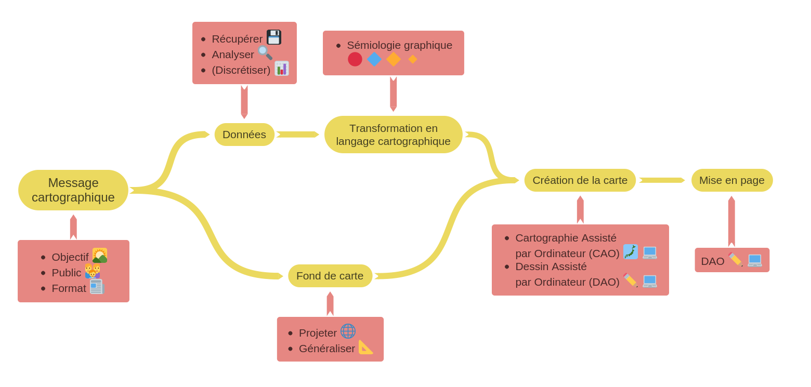
```
] ]

---
class: animated, fadeIn
## Objectifs du cours
<div class="my-footer"><span>Université Paris 1 Panthéon Sorbonne - M1 `r annee` : cartographie et statistique - Florian Bayer</span></div> 
Vous disposez maintenant de toutes les connaissances de base pour construire vos cartes.

- S'il s'agit d'une carte avec des données **qualitatives**, il est possible d'utiliser directement un logiciel de **dessin assisté par ordinateur** (DAO), avec ou sans passage par un SIG pour la localisation des données sur la carte. L'utilisation d'un logiciel de DAO sera abordée lors du prochain cours.
- Pour les données **quantitatives**, la construction des figurés taille et valeur peut également être faite pas un logiciel de DAO, mais avec un risque d'erreur élevé (construction des figurés, discrétisation, nombre important d'individus géographiques). **L'utilisation de logiciel spécialisé en cartographie** est donc recommandé.

---
class: animated, fadeIn
## Faire des cartes avec un ordinateur
<div class="my-footer"><span>Université Paris 1 Panthéon Sorbonne - M1 `r annee` : cartographie et statistique - Florian Bayer</span></div> 
Ils existent plusieurs logiciels permettant de réaliser des cartes
- **Les logiciels spécialisés**, comme Philcarto, Magrit ou Cartes & Données (payant). Ils sont uniquement dédiés à la production de cartes et tentent de guider au mieux l'utilisateur dans son utilisation de la sémiologie gratuite.
- **Les Systèmes d'Information Géographique** (Arcmap, Arcgis Pro, Qgis, Mapinfo). Ce sont avant tout des logiciels de traitement d'information géographique, qui proposent des fonctionnalités de rendu cartographique. Le respect des règles de la sémiologie graphique est rarement leur priorité, même si cela s'améliore depuis quelques années.
- **Des langages de programmation ou de scripting**, comme Python et R. Des outils (packages) spécialisés en cartographie sont développés et mis à disposition gratuitement par la communauté ( [altair](https://altair-viz.github.io/gallery/airport_connections.html), [cartography](https://github.com/riatelab/cartography), [tmap](https://cran.r-project.org/web/packages/tmap/vignettes/tmap-getstarted.html)).

---
class: inverse, center, middle, animated, fadeIn  
# 1- Philcarto et Magrit


<div class="my-footer-title "></div> 

---
class: animated, fadeIn
## Que peut-on faire avec Philcarto et Magrit?

<div class="my-footer"><span>Université Paris 1 Panthéon Sorbonne - M1 `r annee` : cartographie et statistique - Florian Bayer</span></div> 
Philcarto ou Magrit permettent de produire des cartes en mettant en relation des données géographiques avec des données statistiques simplement, dynamiquement et gratuitement.

.font90[.pull-left[
**Philcarto** est développé par Philippe Waniez. Outre la production dynamique de carte thématique, Philcarto propose :
- Analyses statistiques uni-variées (calcul d’indice)
- Bi-variées (régression linéaire + cartographie des résidus)
- Multi-variées (ACP, AFC, CAH) 
- Modèle gravitaire (Huff)
- Interpolation de point (triangulation, Krigeage, surfaces de tendances)
- Indice d’autocorrélation spatiale (sans test de significativité)

Il ne fonctionne que sous Windows et ne permet pas de faire de mise en page
]]

.font90[.pull-right[
**Magrit** est développé par l'UMS RIATE et est disponible en ligne. 

Contrairement à Philcarto, seule des cartes thématiques sont réalisables, dont : 
- Des grilles de densités
- De l'anamorphose

Une mise en page simple peut-être réalisée (sans pour autant avoir toutes les possibilités d'un logiciel de DAO). 
]]


---
class: animated, fadeIn
## Conditions d'utilisation

<div class="my-footer"><span>Université Paris 1 Panthéon Sorbonne - M1 `r annee` : cartographie et statistique - Florian Bayer</span></div> 

.pull-left[
**Philcarto**

Philcarto est disponible sur le site http://philcarto.free.fr mais avec des conditions d’utilisations spécifiques : 

- Toutes les productions faites avec philcarto doivent mentionner « Réalisé avec Philcarto : http://philcarto.free.fr ». 
- Il est également conseillé de le mentionner dans vos travaux (mémoires, articles)
]

.pull-right[
**Magrit**

Magrit est disponible sur le site http://magrit.cnrs.fr. Les manipulations se font en ligne, mais attention, le site n'est pas sécurisé. En d'autre termes, il ne faut pas l'utiliser avec des données sensibles, même s'il est possible de le déployer sur un ordinateur (avec Docker par exemple).
]

---
class: animated, fadeIn
## Exemples de production

<div class="my-footer"><span>Université Paris 1 Panthéon Sorbonne - M1 `r annee` : cartographie et statistique - Florian Bayer</span></div> 
.center-img[
```{r echo=FALSE, out.width="100%"}
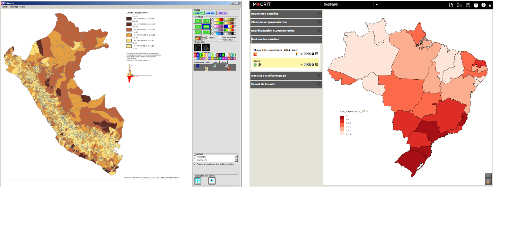
```
]

---
class: animated, fadeIn
## Exemples de production

<div class="my-footer"><span>Université Paris 1 Panthéon Sorbonne - M1 `r annee` : cartographie et statistique - Florian Bayer</span></div> 
.center-img[
```{r echo=FALSE, out.width="100%"}
knitr::include_graphics("./images/7-Philcarto/ex_prod2_v2.png")
```
]

---
class: animated, fadeIn
## Exemples de production

<div class="my-footer"><span>Université Paris 1 Panthéon Sorbonne - M1 `r annee` : cartographie et statistique - Florian Bayer</span></div> 
.center-img[
```{r echo=FALSE, out.width="100%"}
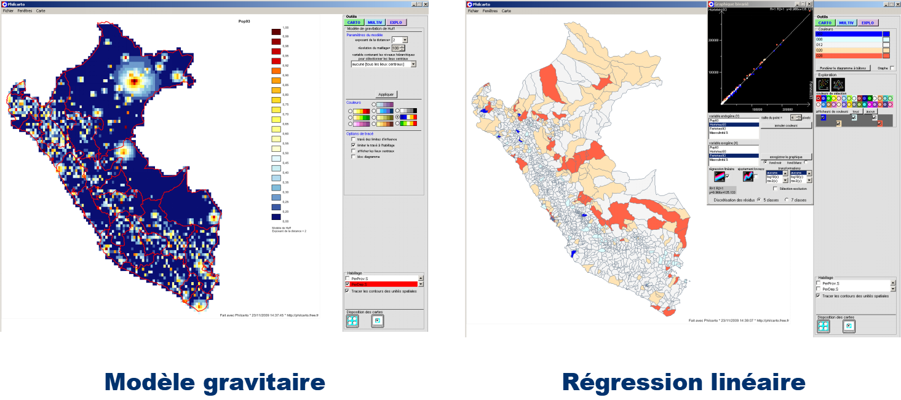
```
]

---
class: inverse, center, middle, animated, fadeIn  
# 2- Utiliser Philcarto et Magrit


<div class="my-footer-title "></div> 

---
class: animated, fadeIn
## Principes

<div class="my-footer"><span>Université Paris 1 Panthéon Sorbonne - M1 `r annee` : cartographie et statistique - Florian Bayer</span></div> 
Philcarto et Magrit ont besoin de deux sources de données pour fonctionner :

.font90[
1- Un fond **vectoriel** comportant un code pour chaque entité géographique. 
- Pour Philcarto, ce fond peut être digitalisé avec Phildigit (gratuit) ou bien Illustrator (format ai). Philcarto accepte également les formats d'échanges SIG comme le shapefile (Qgis).
- Pour Magrit, ce fond seuls les fonds issues d'un SIG peuvent être utilisés : shapefile, geojson, kml

2- Des **données** au format excel ou txt, où chaque ligne correspond aux entités géographiques.

Les logiciels feront une **jointure** : les **identifiants des données** seront alors liées aux **identifiants des polygones** du fond de carte. 
]

```{r echo=FALSE, out.width="75%"}
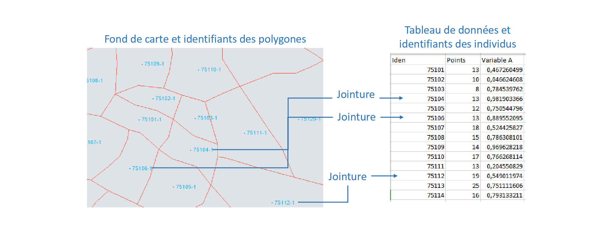
```


---
class: animated, fadeIn
## Le fond de carte

<div class="my-footer"><span>Université Paris 1 Panthéon Sorbonne - M1 `r annee` : cartographie et statistique - Florian Bayer</span></div> 


.pull-left[
**Philcarto** accepte :
- les fonds de cartes *.ai* fais avec Phildigit ou Adobe Illustrator.
- les shapefiles, avec ou sans système de projection
]

.pull-right[
**Magrit** accepte
- les shapefiles avec système de projection
- les GeoJSON, KML ou encore GML

Attention, contrairement à Philcarto, Magrit ne peut pas gérer plusieurs polygones avec le même code. Il faut regrouper ces polygones en multipolygones (cf. guide digitalisation Qgis)
]

---
class: animated, fadeIn
## Rappel fond Phildigit et fond Philcarto

<div class="my-footer"><span>Université Paris 1 Panthéon Sorbonne - M1 `r annee` : cartographie et statistique - Florian Bayer</span></div> 
.center-img[
```{r echo=FALSE, out.width="100%"}
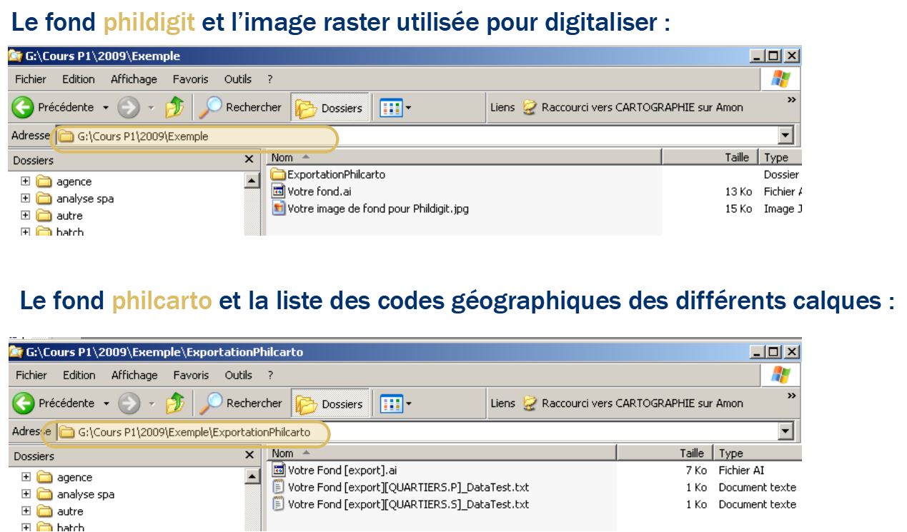
```
]

---
class: animated, fadeIn
## Les données pour Philcarto ou Magrit

<div class="my-footer"><span>Université Paris 1 Panthéon Sorbonne - M1 `r annee` : cartographie et statistique - Florian Bayer</span></div> 

.pull-left[
Les données statistiques doivent se trouver au format **Excel ou txt** . En colonne se trouve les informations statistiques, en ligne les entités géographiques 

- La première colonne doit s’appeler "CODE" ou "Iden". C’est ici que la jointure avec le fond de carte se fera.
- Il ne faut aucune ligne ou colonne vide au début du fichier (première cellule du tableau Excel : CODE)
- Il faut une ligne par entité géographique (pas 2 codes identiques) 

]

.pull-right[
.center-img[
Oui : 
```{r echo=FALSE, out.width="100%"}
df <- data.frame("Code" = c('FR','BE'),
                  "Superficie" = c(551695,30688),
                  "Densité" = c(117.48,370.70))
df %>% kable() %>%
  kable_styling(bootstrap_options = "striped", full_width = F,font_size = 15) 

```
]

.center-img[
Non : 
```{r echo=FALSE, out.width="100%"}
df <- data.frame("Code" = c('FR','FR','BE'),
                  "Superficie" = c(551695,551695,30688),
                  "Densité" = c(117.48,117.48,370.70))
df %>% 
  kable(caption = "Description des données") %>%
  kable_styling(bootstrap_options = "striped", full_width = F,font_size = 15) 

```
]]

---
class: animated, fadeIn
## Formater les données sous Excel

<div class="my-footer"><span>Université Paris 1 Panthéon Sorbonne - M1 `r annee` : cartographie et statistique - Florian Bayer</span></div> 
Attention aux codes numériques sous Excel. Il faut penser à ajouter une apostrophe pour les convertir en texte. 

Exemple : l’Ain, fond de carte : code 01 
- Si on tape **01** sous excel, la cellule affichera : **1**. La jointure ne se fera pas avec le fond de carte.
- Il faut rentrer dans la cellule **'01** pour faire comprendre à Excel qu’il s’agit bien d’un texte et non d’un chiffre. Cette étape est essentielle jusqu’à 9 inclus.

Il faut **éviter les noms de colonnes trop long**. Il faut faire des codes simples et courts, avec dans une feuille à part la définition exacte (**métadonnées**).

Les valeurs non disponibles correspondent à une **cellule vide**


---
class: inverse, center, middle, animated, fadeIn  
# 3- Faire une carte avec Philcarto


<div class="my-footer-title "></div> 

---
class: animated, fadeIn
## Chargement du fond de carte et des données 

<div class="my-footer"><span>Université Paris 1 Panthéon Sorbonne - M1 `r annee` : cartographie et statistique - Florian Bayer</span></div> 

- Lancez Philcarto et acceptez les conditions d'utilisation
- Sélectionnez un fond de carte (format .ai) puis un fichier de données (format xls / xlsx / txt) et la feuille qui contient les données (celles avec le champs CODE)

.center-img[
```{r echo=FALSE, out.width="100%"}
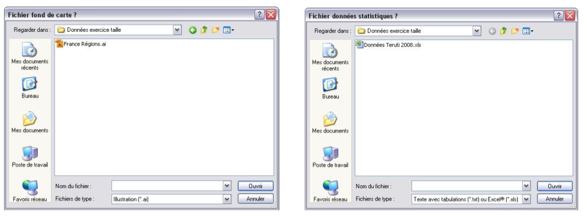
```
]

Si plusieurs couches de même types existent sur le fond de carte, il faut sélectionner celle sur laquel se fera la jointure.  

---
class: animated, fadeIn
## Typage des données

<div class="my-footer"><span>Université Paris 1 Panthéon Sorbonne - M1 `r annee` : cartographie et statistique - Florian Bayer</span></div> 

.pull-left[
Spécifiez le **type des variables** en cliquant dessus (nominal, quantité, rapport). Cette étape est essentielle car les représentations graphiques en dépendent. 

Vous devez donc connaître parfaitement le type de données que vous allez cartographier. 

Vous pouvez à tout moment modifier vos choix avec le bouton : typer les variables]

.pull-right[ .center-img[
```{r echo=FALSE, out.width="100%"}
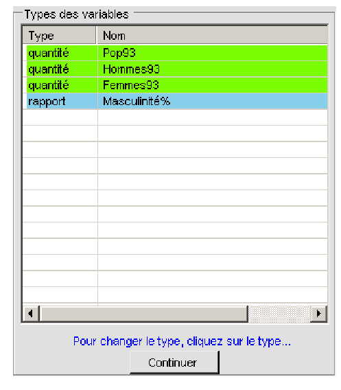
```
]]

---
class: animated, fadeIn
## Fenêtre principale

<div class="my-footer"><span>Université Paris 1 Panthéon Sorbonne - M1 `r annee` : cartographie et statistique - Florian Bayer</span></div> 
.center-img[
```{r echo=FALSE, out.width="100%"}
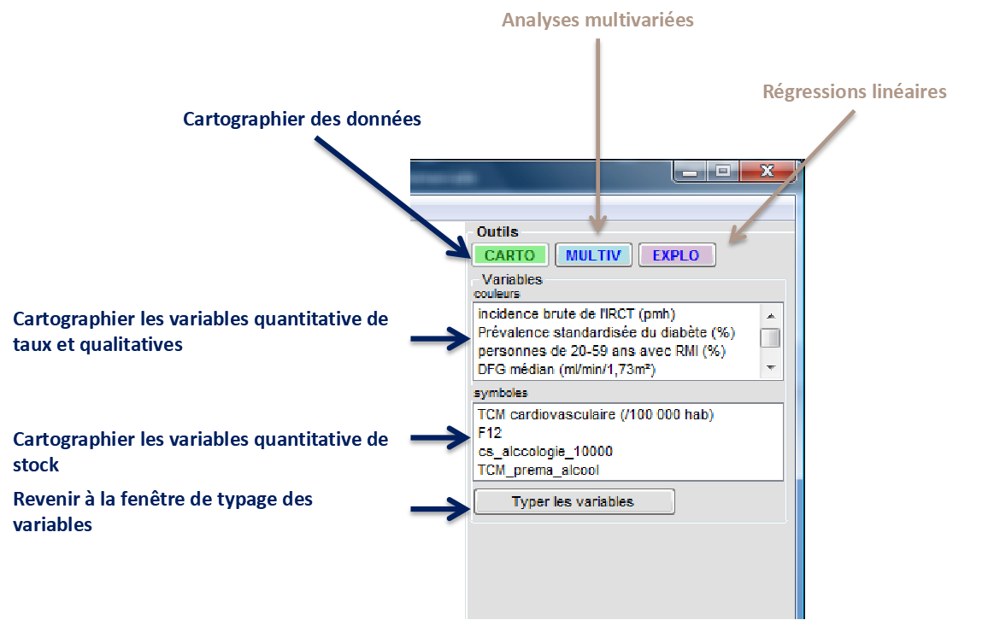
```
]

---
class: animated, fadeIn
## Créer une carte choroplèthe (aplat de valeur)

<div class="my-footer"><span>Université Paris 1 Panthéon Sorbonne - M1 `r annee` : cartographie et statistique - Florian Bayer</span></div> 
.pull-left3[
Pour ouvrir la fenêtre des choroplèthes, il faut veiller à avoir des données de taux. 
Si vous avez des données qualitatives, le processus est exactement le même (la fenêtre suivante sera cependant différente).
- Cliquez sur Carto (1)
- Sélectionnez l’indicateur à cartographier (2)
- Cliquez sur la représentation Choroplèthe (3)

Comme dans les SIG, le choix de différentes plages ou méthodes de représentation ne garantit pas une bonne carte ! Veillez à respecter les règles de la sémiologie graphique. Philcarto vous guide, mais ne peut pas vérifier que la représentation est correcte.
]

.pull-right1[ .center-img[
```{r echo=FALSE, out.width="50%"}
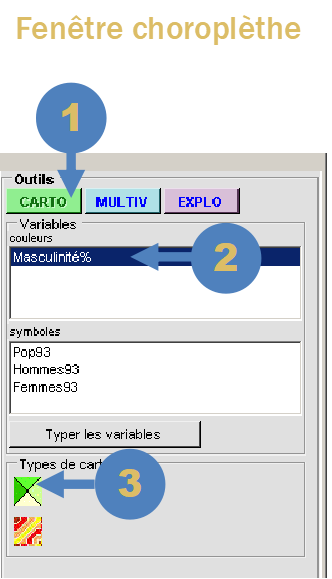
```
]]

---
class: animated, fadeIn
## Créer une carte choroplèthe (aplat de valeur)

<div class="my-footer"><span>Université Paris 1 Panthéon Sorbonne - M1 `r annee` : cartographie et statistique - Florian Bayer</span></div> 
.center-img[
```{r echo=FALSE, out.width="100%"}
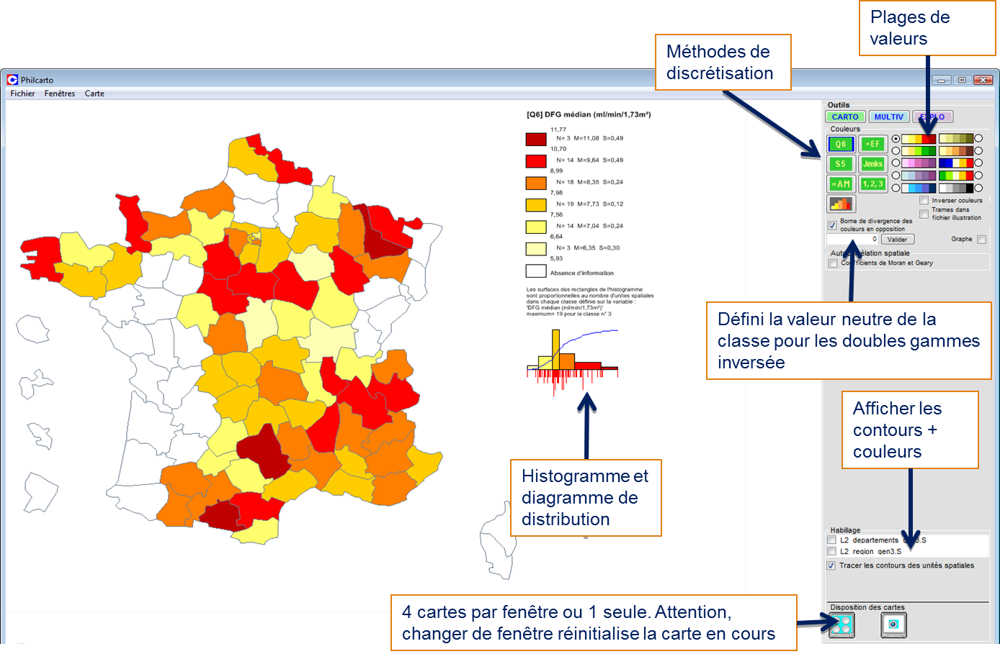
```
]

---
class: animated, fadeIn
## La discrétisation avec Philcarto

<div class="my-footer"><span>Université Paris 1 Panthéon Sorbonne - M1 `r annee` : cartographie et statistique - Florian Bayer</span></div> 
Philcarto propose 6 méthodes de discrétisation. C’est un avantage majeur de la cartographie automatique. Il est cependant essentiel de **connaître** les méthodes de construction et d’utilisation de ces méthodes pour ne pas tomber dans le piège du clic-bouton.

- **Q6** : Discrétisation selon les quartiles plus deux classes extrêmes. Elle sépare 5% des entités géographiques ayant les valeurs les plus grandes, et 5% les plus petites :  *minimum, percentile 5, 1er quartile, médiane, 3e quartile, percentile 95 et maximum*
- **EF** : Méthodes des quantiles (effectifs égaux). Vous pouvez choisir le nombre de classes
- **S5** : Discrétisation selon la moyenne et l’écart-type. A utiliser sur des séries gaussienne : *Minimum / moyenne –1 écart-type / moyenne -0.5 écart type / moyenne +0.5 écart-type / moyenne +1 écart-type / maximum*. 
- **Jenks** : Algorithme permettant de minimiser la variance intra-classe, maximiser la variance inter-classe. Très bon compromis entre information visuelle et information statistique
- **AM** : Discrétisation en amplitude égale. Vous pouvez choisir le nombre de classes
- **1,2,3**: Discrétisation manuelle. Le séparateur est la virgule, il faut ensuite appuyer sur valider.  Si vous décidez d’afficher une fenêtre avec 4 cartes, les cartes suivantes auront la même discrétisation par défaut.


---
class: animated, fadeIn
## Créer une carte avec des cercles proportionnels

<div class="my-footer"><span>Université Paris 1 Panthéon Sorbonne - M1 `r annee` : cartographie et statistique - Florian Bayer</span></div> 
.pull-left[
Pour créer une carte avec des cercles proportionnels, il faut veiller à avoir des données de stock.
- Cliquez sur Carto (1)
- Sélectionnez l’indicateur à cartographier dans « symboles » (2)
- Cliquez sur la représentation cercles proportionnels (3)
]

.pull-right[ .center-img[
```{r echo=FALSE, out.width="50%"}
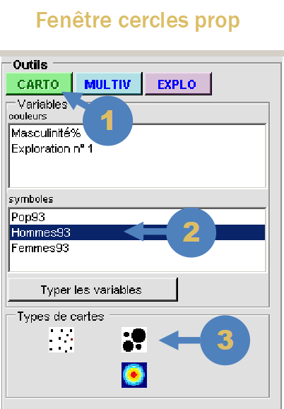
```
]]

---
class: animated, fadeIn
## Créer une carte avec des cercles proportionnels

<div class="my-footer"><span>Université Paris 1 Panthéon Sorbonne - M1 `r annee` : cartographie et statistique - Florian Bayer</span></div> 
.center-img[
```{r echo=FALSE, out.width="100%"}
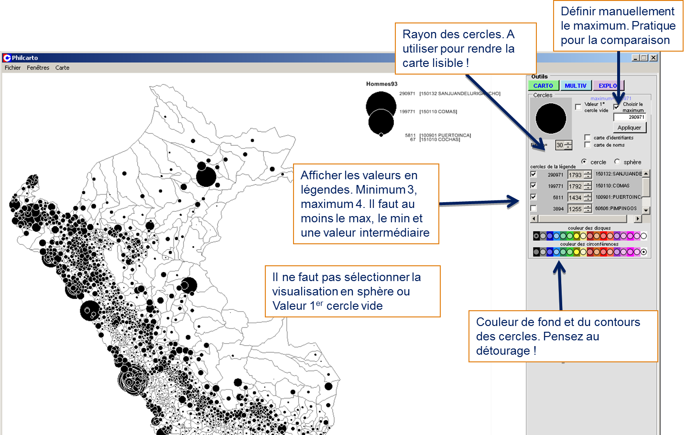
```
]

---
class: animated, fadeIn
## Autres cartes avec Philcarto

<div class="my-footer"><span>Université Paris 1 Panthéon Sorbonne - M1 `r annee` : cartographie et statistique - Florian Bayer</span></div> 
.pull-left[
Philcarto propose de nombreuses autres fonctionnalités, mais elles ne sont à utiliser que si vous maîtrisez les outils proposés (modèle de Huff, CAH etc.). Vous pouvez également faire des cartes de flux mais la conception de la matrice est complexe à réaliser.

Philcarto propose aussi des représentations en demies-cercles ou secteurs : elles ne doivent jamais être utilisées (communication du message cartographique nulle).

]

.pull-right[ .center-img[
```{r echo=FALSE, out.width="100%"}
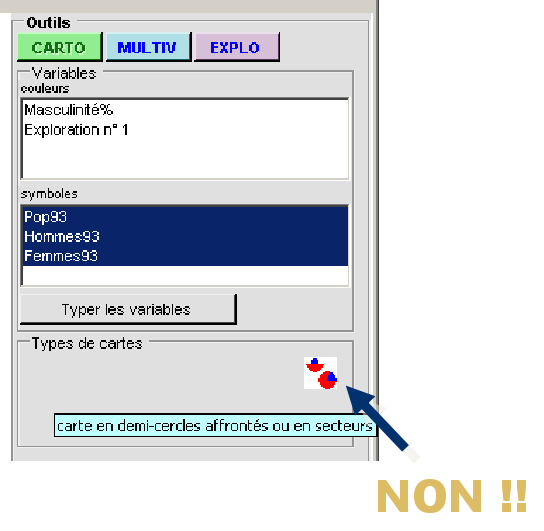
```
]]

---
class: animated, fadeIn
## Exportation en svg

<div class="my-footer"><span>Université Paris 1 Panthéon Sorbonne - M1 `r annee` : cartographie et statistique - Florian Bayer</span></div> 
.pull-left[
Philcarto ne permet pas d’enregistrer une carte afin de la charger postérieurement.
En revanche, il est possible (et obligatoire) d’exporter la carte au format **vectoriel**, afin de réaliser sa mise en page dans Inkscape ou Illustrator

Pour ce cours, privilégiez le format SVG, format facilement lisible par Inkscape. Cet outil sera l'objet du prochain cours.
]

.pull-right[ .center-img[
```{r echo=FALSE, out.width="50%"}
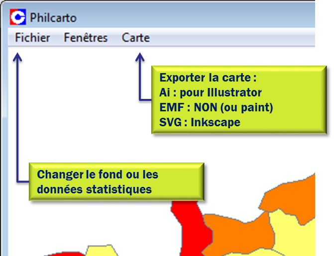
```
]]

---
class: inverse, center, middle, animated, fadeIn  
# 4- Faire une carte avec Magrit


<div class="my-footer-title "></div> 

---
class: animated, fadeIn
## Fenêtre principale

<div class="my-footer"><span>Université Paris 1 Panthéon Sorbonne - M1 `r annee` : cartographie et statistique - Florian Bayer</span></div> 
.center-img[
```{r echo=FALSE, out.width="100%"}
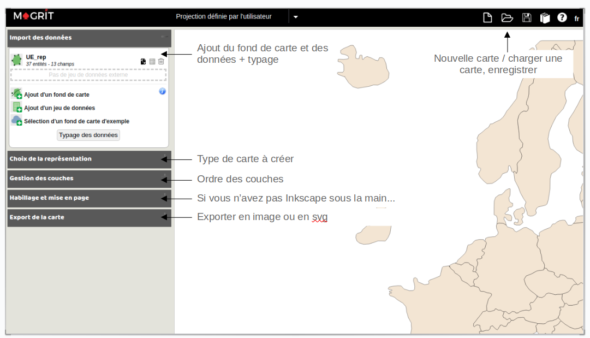
```
]

---
class: animated, fadeIn
## Chargement du fond de carte 

<div class="my-footer"><span>Université Paris 1 Panthéon Sorbonne - M1 `r annee` : cartographie et statistique - Florian Bayer</span></div> 
.pull-left[
- Lancez Magrit : http://magrit.cnrs.fr/modules
- Cliquez sur Ajout d'un fond de carte
- Sélectionnez **tous** les fichiers associés à votre shapefile
- Confirmez qu'il s'agit du fond principal (si vous avez un fond pour votre maillage et un autre pour l'habillage, comme les pays limitrophes, définissez le maillage comme fond principal. Chargez ensuite le fond d'habillage et sélectionnez fond d'habillage)
- Utilisez les informations de projection contenues dans le fichier
- Enfin, choisissez la colonne qui contient les **identifiants** de vos polygones. Si d'autres données sont disponibles dans la table attributaire de votre shapefile, vous pouvez les typer (cf. diapo suivante)
]

.pull-right[ .center-img[
```{r echo=FALSE, out.width="80%"}
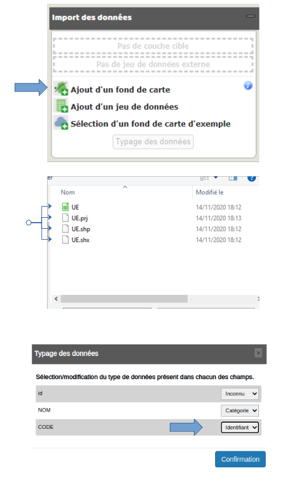
```
]]


---
class: animated, fadeIn
## Ajout et typage des données

<div class="my-footer"><span>Université Paris 1 Panthéon Sorbonne - M1 `r annee` : cartographie et statistique - Florian Bayer</span></div> 
.pull-left3[
Chargez ensuite vos données Excel en **Ajoutant un jeu de données**
- Acceptez de joindre le fond de carte à vos données : sélectionnez le champ de la couche géographique qui contient les codes des polygones et faites de même pour le champ de votre fichier Excel. Dans l'exemple, les deux champs s'appellent *CODE*. 
- Il se peut que certaines jointures ne se fassent pas. Conservez les données sur la carte.
- Si tout se passe bien, Magrit va effectuer la jointure, c'est à dire qu'en connaissant le code d'un polygone sur le fond, il est capable de trouver la ligne de données correspondante dans le fichier Excel
- Si Magrit vous dit qu'il faut des champs uniques, il faut modifier votre fond car plusieurs lignes portent le même code (cf. guide digitalisation avec Qgis, à partir de la page 23).
- Typer enfin vos variables (identifiant = CODE, stock, ratio = taux, catégorie = nominal)
]
.pull-right1[ .center-img[
```{r echo=FALSE, out.width="80%"}
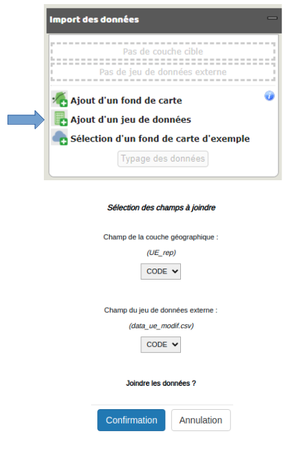
```
]]


---
class: animated, fadeIn
## Créer une carte choroplèthe (aplat de valeur)

<div class="my-footer"><span>Université Paris 1 Panthéon Sorbonne - M1 `r annee` : cartographie et statistique - Florian Bayer</span></div> 
.pull-left3[
Pour ouvrir la fenêtre des choroplèthes, il faut veiller à avoir des données de taux. 
Si vous avez des données qualitatives, le processus sera exactement le même (la fenêtre suivante sera cependant différente).
- Cliquez sur **Réalisation d'une carte de ratios**
- Dans la nouvelle fenêtre, sélectionnez le champs à cartographier
- Sélectionnez la méthode de discrétisation (Q6, Jenks, Amplitudes Égales, Quantile). En cliquant sur la **roue**, vous accéderez à d'autres méthodes de discrétisation et à l'histogramme (cf. diapo suivante)
- Cliquez **Dessiner le résultat** pour afficher votre carte

Comme dans les SIG, le choix de différentes plages ou méthodes de représentation ne garantie pas une bonne carte ! Veillez à respecter les règles de la sémiologie graphique. Magrit vous guide, mais ne peut pas vérifier que la représentation est correcte.
]

.pull-right1[ .center-img[
```{r echo=FALSE, out.width="80%"}
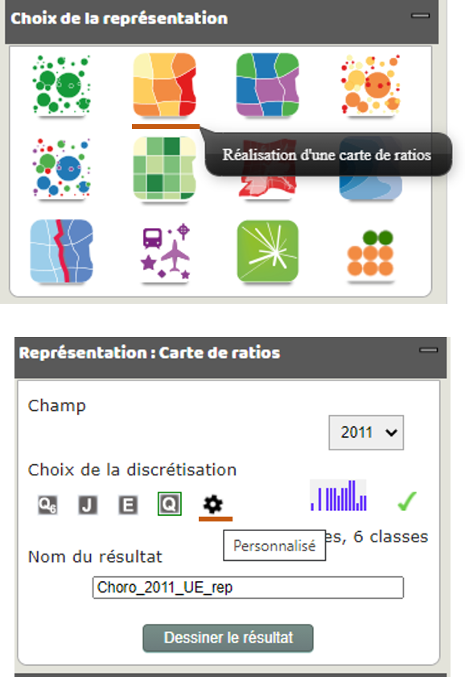
```
]]

---
class: animated, fadeIn
## Créer une carte choroplèthe (aplat de valeur)

<div class="my-footer"><span>Université Paris 1 Panthéon Sorbonne - M1 `r annee` : cartographie et statistique - Florian Bayer</span></div> 
.center-img[
```{r echo=FALSE, out.width="100%"}
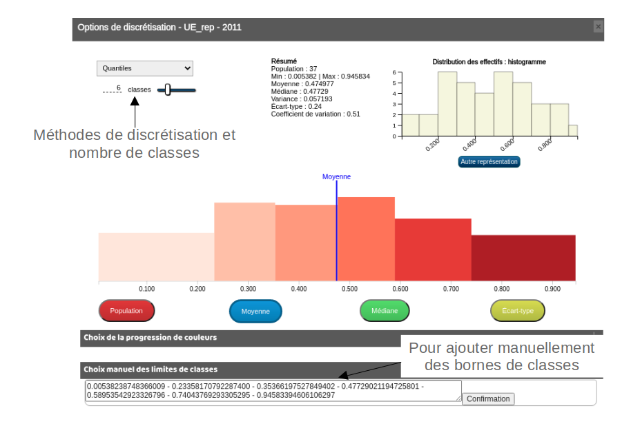
```
]

---
class: animated, fadeIn
## Créer une carte avec des cercles proportionnels

<div class="my-footer"><span>Université Paris 1 Panthéon Sorbonne - M1 `r annee` : cartographie et statistique - Florian Bayer</span></div> 
.pull-left3[
La création d'une carte avec des cercles proportionnels suit la même logique
- Cliquez sur **Réalisation d'une carte de stocks**
- Dans la nouvelle fenêtre, sélectionnez le champs à cartographier
- Les champs Taille fixé en pixel et sur la valeur ... permettent de définir manuellement la taille d'un cercle pour la valeur renseignée. Ceci est obligatoire lorsque vous devez comparer des cartes, afin que les cercles soient comparables. Dans l'exemple, si on devait faire la carte pour 2015, on mettrait de nouveau une taille à 60 px pour la valeur 143056383.
- Cliquez **Dessiner le résultat** pour afficher votre carte

]

.pull-right1[ .center-img[
```{r echo=FALSE, out.width="80%"}
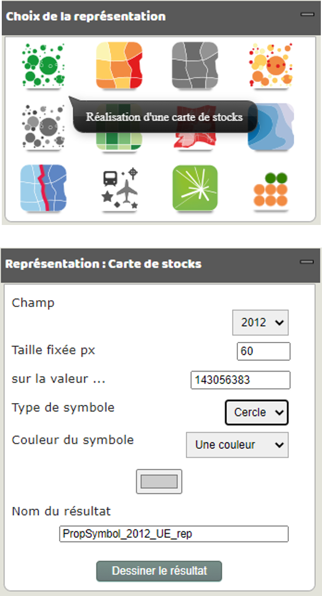
```
]]

---
class: animated, fadeIn
## Gestion des couches

<div class="my-footer"><span>Université Paris 1 Panthéon Sorbonne - M1 `r annee` : cartographie et statistique - Florian Bayer</span></div> 
.font90[.pull-left3[
Magrit permet de mettre en page sa carte
- La fenêtre **Gestion des couches** permet de modifier ou supprimer une représentation. Vous pouvez même changer l'ordre des couches s'il en existe plusieurs (cercles proportionnels au-dessus de la carte choroplèthe).
- La fenêtre Habillage et mise en page permet d'ajouter et d'ajuster les éléments de la mise en page.
- Un clic gauche + maintenir sur les éléments de la carte permet de les déplacer
- En cliquant droit sur certains éléments de la mise en page directement sur la carte, comme la légende, vous pouvez modifier son contenu (comme les valeurs à représenter dans la légende des cercles proportionnels)

Si ces outils sont pratiques pour réaliser rapidement une carte, nous verrons dans le prochain cours comment faire une mise en page avec les outils de Dessin Assisté par Ordinateur (DAO), beaucoup plus puissants. En maîtrisant un outil de DAO, vous pourrez faire des mises en page sur tous les outils de cartographie. L'inverse n'est pas valable.
]

.pull-right1[ .center-img[
```{r echo=FALSE, out.width="80%"}
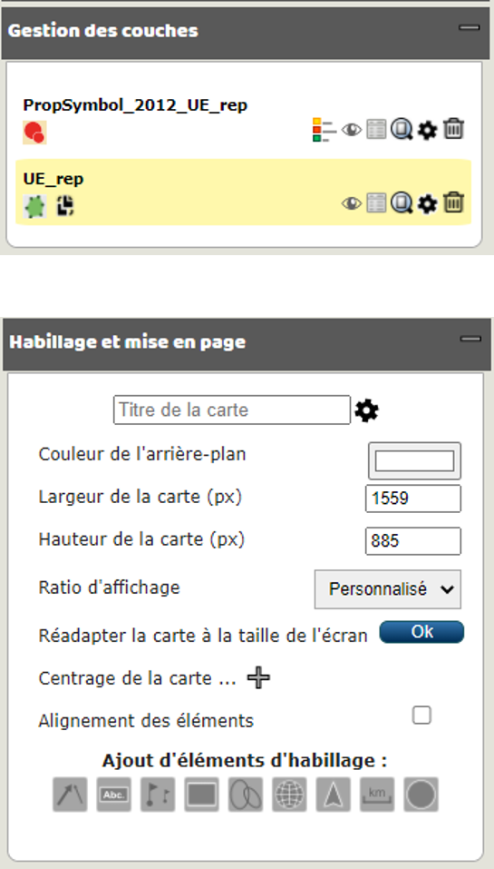
```
]]]

---
class: animated, fadeIn
## Exportation en svg

<div class="my-footer"><span>Université Paris 1 Panthéon Sorbonne - M1 `r annee` : cartographie et statistique - Florian Bayer</span></div> 
.pull-left[
Magrit permet de sauvegarder la carte pour la reprendre plus tard en ligne. 

Il est aussi possible et fortement recommandé d’exporter la carte au format **vectoriel**, afin de réaliser sa mise en page dans Inkscape ou Illustrator

Pour ce cours, privilégiez le format SVG, format facilement lisible par Inkscape. Cet outil sera l'objet du prochain cours.
]

.pull-right[ .center-img[
```{r echo=FALSE, out.width="80%"}
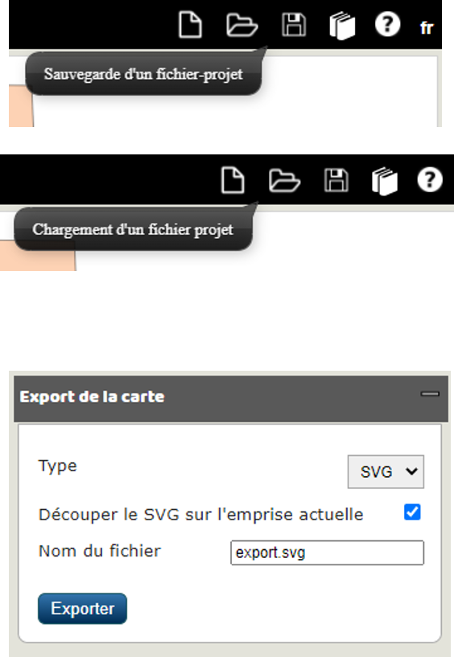
```
]]


---
class: inverse, center, middle, animated, fadeIn  
# Conclusions


<div class="my-footer-title "></div> 

---
class: animated, fadeIn
## Concepts clés
<div class="my-footer"><span>Université Paris 1 Panthéon Sorbonne - M1 `r annee` : cartographie et statistique - Florian Bayer</span></div> 
Pour faciliter la tâche du cartographe, il existe des outils plus ou moins spécialisés de cartographie. Ils permettent d'automatiser en partie la production de la carte :

- Ajout des aplats
- Calculs des cercles proportionnels
- Applications des méthodes de discrétisation

Il est néanmoins essentiel de connaître le principe de fonctionnement de toutes ces fonctionnalités afin de ne pas **cliquer** sur tous les boutons du logiciel, sans comprendre la logique et les objectifs des différentes fonctionnalités.

A noter que ces outils de production cartographique ne permettent pas ou avec un certain nombre de limites de mettre en page une carte. Un outil de dessin assisté par ordinateur comme Inkscape ou Illustrator est alors nécessaire.


---
class: animated, fadeIn
## Résolution des problèmes Philcarto 
<div class="my-footer"><span>Université Paris 1 Panthéon Sorbonne - M1 `r annee` : cartographie et statistique - Florian Bayer</span></div> 
Philcarto dit qu’il ne peut pas faire la jointure ou qu’il ne trouve pas les identifiants : 
- Vérifiez que le champ code est bien présent dans vos données et sur votre fond. Vérifiez aussi qu’ils sont identiques.

Philcarto se ferme après le chargement du fond ou dit que le format n’est pas correct
- Vérifiez que vous n’avez pas enregistré votre fond de carte au format illustrator CS1 / CS2 avec compression. Sauvegardez le fond au format 10 sans compression.

Philcarto se ferme après le chargement des données statistiques
- Vérifiez que le nom des colonne n’est pas trop long

Philcarto ne trouve pas de calque .P .S ou .L
- Vérifiez que vous avez bien au moins un calque correctement nommé dans votre fond ai. Une fois modifié, n’oubliez pas de sauvegarder le fichier sans compression

Help, ma carte est à l'envers !! 
- Vous avez chargé le fond de carte Phildigit et non le fond de carte exporté pour Philcarto

---
class: animated, fadeIn
## Résolution des problèmes Magrit 
<div class="my-footer"><span>Université Paris 1 Panthéon Sorbonne - M1 `r annee` : cartographie et statistique - Florian Bayer</span></div> 
Magrit dit qu’il ne peut pas faire la jointure : 
- Vérifiez que les codes sont identiques entre votre fond et vos données

Magrit dit qu'il ne peut pas faire de jointure car plusieurs entités ont le même code
- Il faut regrouper les polygones qui ont le même code dans votre fond. Cf. guide digitalisation Qgis page 23

Le site de Magrit ne marche plus
- Rien ne garantit l'utilisation de Magrit... Certains fonds peuvent faire planter le site. Si vous êtes à l'aise en informatique, vous pouvez monter Magrit sur votre ordinateur avec Docker


