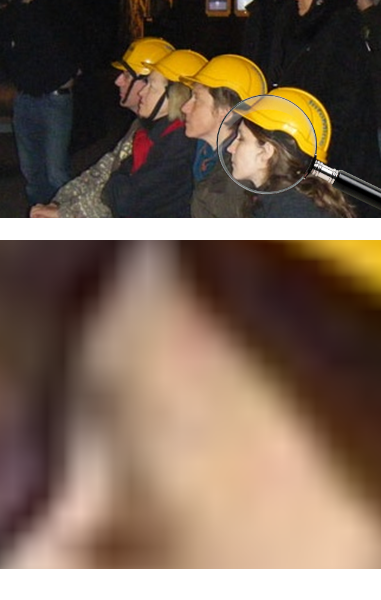

```{r setup, global_options,include=FALSE}
knitr::opts_chunk$set(
  dpi = 200,
  #fig.width = 7,
  #fig.height = 4,
  strip.white = T,
  #dev = "png",
  #dev.args = list(png = list(bg = "transparent")),
  message=FALSE,
  comment=NA,
  echo=FALSE,
  warning=FALSE,
  eval=TRUE
  
)
```

```{r include=FALSE}
source('./assets/functions.R')

# Les librairies
#devtools::install_github("ropenscilabs/rnaturalearth")
requiredPackages = c('knitr','kableExtra','dotenv')

PackageFacile(requiredPackages)

Plotly = TRUE
load_dot_env(".env")
annee=Sys.getenv("annee")

```

class: center, middle, inverse, title-slide, animated, fadeIn
# Cartographie et statistique M1 `r annee`
# Cours n°8- La mise en page cartographique<br /> <br />
### Florian Bayer


<div class="my-footer"><span>Université Paris 1 Panthéon Sorbonne - M1 `r annee` : cartographie et statistique - Florian Bayer</span></div> 


---
class: animated, fadeIn
## Schéma de production
<div class="my-footer"><span>Université Paris 1 Panthéon Sorbonne - M1 `r annee` : cartographie et statistique - Florian Bayer</span></div> 

.zoom[ .center-img[
```{r echo=FALSE, out.width="100%"}
knitr::include_graphics("./images/1_Message/Image19.png")
```
] ]

---
class: animated, fadeIn
## Objectifs du cours
<div class="my-footer"><span>Université Paris 1 Panthéon Sorbonne - M1 `r annee` : cartographie et statistique - Florian Bayer</span></div> 

Apprendre à utiliser un logiciel de Dessin Assisté par Ordinateur (DAO)
- Inkscape
- Adobe Illustrator

Apprendre à mettre en page une carte avec un logiciel de DAO

---
class: animated, fadeIn
## Rappels
<div class="my-footer"><span>Université Paris 1 Panthéon Sorbonne - M1 `r annee` : cartographie et statistique - Florian Bayer</span></div> 

Une carte est un message visuel qui doit transmettre le plus rapidement une information au lecteur 

Ce message doit :
- Etre clair et efficace
- Demander un minimum de temps de compréhension et d’analyse pour le lecteur
- Apparaître d'abord au niveau de l’ensemble de la carte et puis dans le détail

Dans le cas contraire, le lecteur ne prêtera pas attention à la carte

La mise en page de la carte est, au même titre que la sémiologie graphique, un élément **majeur** de la production d’une carte. Elle permet de garantir la **bonne transmission** du message cartographique.

---
class: animated, fadeIn
## Les objectifs de la mise en page cartographique
<div class="my-footer"><span>Université Paris 1 Panthéon Sorbonne - M1 `r annee` : cartographie et statistique - Florian Bayer</span></div> 

La mise en page cartographique est un élément majeur car elle donne un sens à la carte

C'est une **aide à la communication** du message cartographique
- Doit aider le travail de lecture du public cible
- Doit être simple et efficace
- Doit permettre de minimiser le temps de lecture
- Ne doit pas ce faire en fonction du support mais de la carte
- Doit être "aérer" sans trop l’être…
- Doit permettre à la carte de ce suffire à elle même

Il **faut** qu’elle respecte le **principe du moindre effort** pour le LECTEUR (pas pour le cartographe)

---
class: inverse, center, middle, animated, fadeIn  
# 1- Les éléments essentiels de la mise en page


<div class="my-footer-title "></div> 

---
class: animated, fadeIn
## Les éléments obligatoires
<div class="my-footer"><span>Université Paris 1 Panthéon Sorbonne - M1 `r annee` : cartographie et statistique - Florian Bayer</span></div> 

Les éléments de l’habillage et de la mise en page qui suivent sont obligatoires et doivent être hiérarchisés : 

1. .font130[ **Titre**]
2. **Titre de légende**
3. Données de la légende
4. .font80[ Echelle / Auteur / *Source* / Date]

Pour cela, il faut jouer sur la taille et la **graisse**. La source est par convention en *italique*

---
class: animated, fadeIn
## Le titre
<div class="my-footer"><span>Université Paris 1 Panthéon Sorbonne - M1 `r annee` : cartographie et statistique - Florian Bayer</span></div> 

.pull-left[
Première **lecture** du document, il doit donc:
- Etre simple, clair et visible 
- Informer le lecteur sur le message principal de la carte (général)
- Etre placé de préférence en haut de la carte (centre ou à gauche)
- Rien de technique ni signe mathématique
- Encadrer ou souligner le titre ne fait que surcharger la carte 
- Le mettre en majuscule permet de souligner le message (agressif en terme de communication)
- Pas plus de deux lignes pour un titre 
]

.pull-right[
```{r echo=FALSE, out.width="85%"}

```
]


---
class: animated, fadeIn
## La légende
<div class="my-footer"><span>Université Paris 1 Panthéon Sorbonne - M1 `r annee` : cartographie et statistique - Florian Bayer</span></div> 
.pull-left[

Elle doit informer **précisément sur la nature des données** cartographiées.
.font90[
- Elle est pensée en fonction du public
- Elle est hiérarchisée 
- Elle est exhaustive et fidèle à la carte
- Son titre est plus précis que celui de la carte. Il informe le lecteur sur la nature exacte des données (unités si quantitatif)
- La légende est placée de préférence en bas de la carte
- Ne pas spécifier : "légende" (surcharge inutile)
- Pour des données de stocks non discrétisées : 3 ou 4 figurés témoins (min, max et une ou deux valeurs intermédiaires)
- Pour des données de taux : pas de signe mathématique inutile, Si possible, faire des classes arrondies. Le minimum et le maximum sont visibles.
]]

.pull-right[
```{r echo=FALSE, out.width="100%"}

```
]

---
class: animated, fadeIn
## L'échelle
<div class="my-footer"><span>Université Paris 1 Panthéon Sorbonne - M1 `r annee` : cartographie et statistique - Florian Bayer</span></div> 

Le rapport entre une distance sur la carte et la distance réelle
- 1/25 000 :  1 cm sur la carte = 250 m dans la réalité (25  000 cm)
- Plus le dénominateur est élevé, plus la surface représentée est importante
- Petite échelle = grande surface représentée 1 / 1 000 000 (1cm  10 km)

.center-img[
```{r echo=FALSE, out.width="75%"}

```
]

L’échelle permet l’évaluation de l’espace étudié. Elle peut être graphique ou numérique. Il faut privilégier les échelles graphiques simples car elles sont faciles à lire et ne subissent pas les effets d’une réduction en cas de photocopie + réduction / agrandissement

.center-img[
```{r echo=FALSE, out.width="30%"}

```
]

---
class: animated, fadeIn
## Les autres éléments obligatoires
<div class="my-footer"><span>Université Paris 1 Panthéon Sorbonne - M1 `r annee` : cartographie et statistique - Florian Bayer</span></div> 

L’auteur (ou les auteurs)
- La ou les personnes qui ont réalisés la carte. 
- Si vous travaillez pour une entreprise, l’auteur sera parfois remplacé par le nom de l’entreprise. Toutefois, essayer toujours d’ajouter le votre…

La ou les sources
- Elle permet de préciser **l’origine** et la **date** des documents utilisées.
- Elle doit être discrète et en italique. 
- Elle permet de juger de la fiabilité du document.

Date
- La date de la conception des sources. 
- Si la date des chiffres est différente de la date des données, il faut l’indiquer (souvent dans le titre).

---
class: inverse, center, middle, animated, fadeIn  
# 2- Les éléments de la mise en page non obligatoires


<div class="my-footer-title "></div> 


---
class: animated, fadeIn
## Le cadre

<div class="my-footer"><span>Université Paris 1 Panthéon Sorbonne - M1 `r annee` : cartographie et statistique - Florian Bayer</span></div> 

.pull-left[
Sa présence dépend de la mise en page et de l’aspect voulu. 
- Il permet parfois de mieux séparer la carte d’un texte (document Word),
- Sa présence est avant tout une question de gout, de surcharge et d’incrustation de la carte
- Un seul cadre est suffisant. Encadrer le titre + la carte + la légende ne fera que brouiller la lecture
- Créer un cadre permet cependant d’ajouter un léger fond à la carte :
]

.pull-right[
.center-img[
```{r echo=FALSE, out.width="60%"}

```
]]

---
class: animated, fadeIn
## L'orientation

<div class="my-footer"><span>Université Paris 1 Panthéon Sorbonne - M1 `r annee` : cartographie et statistique - Florian Bayer</span></div> 

.pull-left[
Par convention, le nord correspond au haut de la carte.
- La flèche du Nord est donc inutile si c’est le cas
- Elle doit être ajoutée de façon discrète si ce n’est pas le cas ou pour lever une ambiguïté
]

.pull-right[
.center-img[
```{r echo=FALSE, out.width="100%"}

```
]]


---
class: inverse, center, middle, animated, fadeIn  
# 3- Construction et exemple de mise en page


<div class="my-footer-title "></div> 


---
class: animated, fadeIn
## Principe

<div class="my-footer"><span>Université Paris 1 Panthéon Sorbonne - M1 `r annee` : cartographie et statistique - Florian Bayer</span></div> 

La mise en page se fait en fonction de la carte et non de la place disponible sur la page. Il ne faut donc pas s’étaler sur la page en fonction de la place disponible mais orghaniser les éléments en fonction de la carte. 

On peut par exemple créer un cadre virtuel autours de la carte, qui augmente au fur et à mesure de l'ajout des éléments de la mise en page.
.center-img[
```{r echo=FALSE, out.width="100%"}

```
]

---
class: animated, fadeIn
## Exemple : portrait

<div class="my-footer"><span>Université Paris 1 Panthéon Sorbonne - M1 `r annee` : cartographie et statistique - Florian Bayer</span></div> 

.center-img[
```{r echo=FALSE, out.width="100%"}

```
]

---
class: animated, fadeIn
## Exemple : paysage

<div class="my-footer"><span>Université Paris 1 Panthéon Sorbonne - M1 `r annee` : cartographie et statistique - Florian Bayer</span></div> 

<br>
.center-img[
```{r echo=FALSE, out.width="60%"}

```
]

---
class: animated, fadeIn
## Exemples 1

<div class="my-footer"><span>Université Paris 1 Panthéon Sorbonne - M1 `r annee` : cartographie et statistique - Florian Bayer</span></div> 

.pull-left[.center-img[
```{r echo=FALSE, out.width="100%"}

```
]]

.pull-right[.center-img[
```{r echo=FALSE, out.width="100%"}

```
]]

---
class: animated, fadeIn
## Exemples 2

<div class="my-footer"><span>Université Paris 1 Panthéon Sorbonne - M1 `r annee` : cartographie et statistique - Florian Bayer</span></div> 

<br>
.center-img[.font70[Légende commune]]
<br>

.pull-left[.center-img[
```{r echo=FALSE, out.width="100%"}
knitr::include_graphics("./images//8-MEP/paris.png")
```
]]

.pull-right[.center-img[
```{r echo=FALSE, out.width="80%"}

```
]]


---
class: animated, fadeIn
## Exemples 3

<div class="my-footer"><span>Université Paris 1 Panthéon Sorbonne - M1 `r annee` : cartographie et statistique - Florian Bayer</span></div> 

.pull-left[.center-img[
.font70[Carte sans cadre]
```{r echo=FALSE, out.width="100%"}

```
]]

.pull-right[.center-img[
.font70[Cadre de légende dans la carte]
```{r echo=FALSE, out.width="100%"}

```
]]


---
class: animated, fadeIn
## Exemples 4

<div class="my-footer"><span>Université Paris 1 Panthéon Sorbonne - M1 `r annee` : cartographie et statistique - Florian Bayer</span></div> 

.pull-left[.center-img[
.font70[Légende à l'intérieur de la carte]
```{r echo=FALSE, out.width="100%"}

```
]]

.pull-right[.center-img[
.font70[Légende à l'extérieur de la carte]
```{r echo=FALSE, out.width="100%"}

```
]]


---
class: inverse, center, middle, animated, fadeIn  
# 4- Les outils informatiques


<div class="my-footer-title "></div> 

---
class: animated, fadeIn
## Le mode raster et le mode vecteur 

<div class="my-footer"><span>Université Paris 1 Panthéon Sorbonne - M1 `r annee` : cartographie et statistique - Florian Bayer</span></div> 

En informatique, il existe deux manières de représenter une image : en mode **raster** ou en mode **vecteur.**
A noter que les deux peuvent porter de l'information et sont utilisés dans les SIG, mais pour des objectifs différents.

.pull-left[
Raster :
- Image composée de pixels 
- Chaque pixel prend une valeur (Rouge Vert Bleu - RVB)
- Plus les pixels sont nombreux, meilleurs est la qualité (la dernière télé Mecha HD super max)
- Joue sur la qualité d'une image à l'impression
- N’est pas modifiable autrement que par le changement des valeurs des pixels
- Logiciels : Photoshop, Paint, The Gimp
- Formats :JPG, BMP, PNG, GIF, TIFF …
]

.pull-right[.center-img[
```{r echo=FALSE, out.width="60%"}

```
]]

---
class: animated, fadeIn
## Le mode vecteur 

<div class="my-footer"><span>Université Paris 1 Panthéon Sorbonne - M1 `r annee` : cartographie et statistique - Florian Bayer</span></div> 


.pull-left[
Vecteur:
- Des tracés mathématiques (points, lignes, polygones)
- Les zooms peuvent se faire à l'infini sans perte de qualité
- L'impression est toujours de bonne qualité (texte)
- Souvent moins volumineux qu'un raster
- Mais moins de possibilité de traitement (filtres)
- Plus difficile à manier
- Modifiable à volonté
- Logiciel : Illustrator, Inkscape
- Votre fond de carte Phildigit est en mode vecteur
]

.pull-right[.center-img[
```{r echo=FALSE, out.width="75%"}

```
]]

---
class: animated, fadeIn
## Inkscape
<div class="my-footer"><span>Université Paris 1 Panthéon Sorbonne - M1 `r annee` : cartographie et statistique - Florian Bayer</span></div> 

Inkscape est un logiciel libre de dessin vectoriel.Il est téléchargeable à l’adresse suivante : www.inkscape.org. Extension des fichiers créés : .svg
Fenêtre principale

.center-img[
```{r echo=FALSE, out.width="90%"}

```
]

---
class: animated, fadeIn
## Les calques
<div class="my-footer"><span>Université Paris 1 Panthéon Sorbonne - M1 `r annee` : cartographie et statistique - Florian Bayer</span></div> 

.pull-left[
- Les calques permettent d'organiser tous les éléments d'une illustration. 
- Ils font office de dossiers transparents contenant les différentes illustrations.
- Il est possible de modifier l'ordre d'empilement des calques, ce qui se traduira à l'affichage : les calques du dessus masquent ceux d'en dessous
- Les éléments de chaque calque peuvent être déplacés dans un autre calque.
]

.pull-right[.center-img[
```{r echo=FALSE, out.width="100%"}

```
]]

---
class: animated, fadeIn
## Les outils
<div class="my-footer"><span>Université Paris 1 Panthéon Sorbonne - M1 `r annee` : cartographie et statistique - Florian Bayer</span></div> 

.pull-left[
Différents outils vous permettent de manipuler les objets vectoriels
- L'outil de **sélection** sélectionne une objet dans son ensemble, mais permet aussi de modifier sa taille et son orientation
- L'outil de **sélection directe** permet de sélectionner les noeuds ou les lignes qui composent un objet (comme sous Phildigit)
- Des outils formes permettent de créer des rectangles (pratique pour des caissons de légende) ou des cercles
- Vous pouvez aussi écrire du texte (titre, légende, etc.)
]

.pull-right[.center-img[
```{r echo=FALSE, out.width="100%"}
knitr::include_graphics("./images//8-MEP/inkscape3.PNG")
```
]]

.font80[Notez que la touche Ctrl du clavier est une touche **magique** sur Inkscape (Shift sous Illustrator). En la maintenant, vous pouvez sélectionner plusieurs objets un a un ou encore conserver la proportionnalité hauteur*largeur d'un objet (pour faire un carré et non un rectangle)]
---
class: animated, fadeIn
## Couleurs, fond et contours
<div class="my-footer"><span>Université Paris 1 Panthéon Sorbonne - M1 `r annee` : cartographie et statistique - Florian Bayer</span></div> 

.pull-left[
Chaque objet est défini par un fond et un contour. Trois menus sont disponibles pour gérer ces attributs. 

- menu "objets" > "remplissage et contours"
- l'onglet "Fond" modifie la couleur de fond de l'objet
- "Contour" son... contour
- Style du contour permet de modifier l'épaisseur du contours, d'ajouter des flèches ou des pointillés
- Vous pouvez modifier la couleur en mode Rouge Vert Bleu, Cyan Magenta Jaune Noir ou directement avec un code hexadecimale
]

.pull-right[.center-img[
```{r echo=FALSE, out.width="100%"}

```
]]

---
class: animated, fadeIn
## Alignement
<div class="my-footer"><span>Université Paris 1 Panthéon Sorbonne - M1 `r annee` : cartographie et statistique - Florian Bayer</span></div> 

.pull-left[
La fenêtre Aligner et distribuer permet de gérer facilement les différents éléments de la mise en page

- Aligner en haut, en bas, à gauche, à droite
- Faire en sorte que les espaces entre chaque objet soient de tailles identiques (distribuer)
]

.pull-right[.center-img[
```{r echo=FALSE, out.width="100%"}

```
]]

---
class: animated, fadeIn
## Exercices
<div class="my-footer"><span>Université Paris 1 Panthéon Sorbonne - M1 `r annee` : cartographie et statistique - Florian Bayer</span></div> 

Plusieurs exercices sont disponibles sur le site du cours pour vous apprendre à utiliser [Inkscape](https://cours.univ-paris1.fr/pluginfile.php/848534/mod_folder/content/0/TD%20Inkscape.zip?forcedownload=1)

Il sont également disponible pour [Illustrator](https://cours.univ-paris1.fr/pluginfile.php/848534/mod_folder/content/0/TD%20Illustrator.zip?forcedownload=1)

---
class: inverse, center, middle, animated, fadeIn  
# Conclusion


<div class="my-footer-title "></div> 

---
class: animated, fadeIn
## Concepts clés
<div class="my-footer"><span>Université Paris 1 Panthéon Sorbonne - M1 `r annee` : cartographie et statistique - Florian Bayer</span></div> 

La mise en page de la carte est, au même titre que la sémiologie graphique ou la discrétisation, une **étape majeure** de la conception cartographique

Elle permet : .font90[
- de **transmettre rapidement l'information** au lecteur
- en le guidant à l'aide d'éléments **hiérachisés**, aussi bien **visuellement** que dans leurs **messages** (titre infrome sur ce que vous souhaitez montrer, titre de légende précise l'indicateur)
- d'ajouter un **truc graphique** à votre carte, aidant à capter l'attention du lecteur
]

La mise en page suit quelques règles de construction : .font90[
- elle se fait en **fonction de la carte** et non de la place disponible sur la carte.
- ce qui permet de **balancer les espaces** entre les éléments qui la composent.
- Elle respecte le **principe du moindre effort pour le lecteur** (mais pas pour le cartographe, qui doit souvent tâtonner pour obtenir un bon rendu)
]

Le lecteur pourra ainsi assimiler le plus rapidement possible l'information globable de votre carte, avant de rentrer dans le détail. Réussir sa mise en page, c'est garantir de capter l'attention du lecteur. C'est la dernière étape de votre travail, elle ne doit pas être bâclée !
